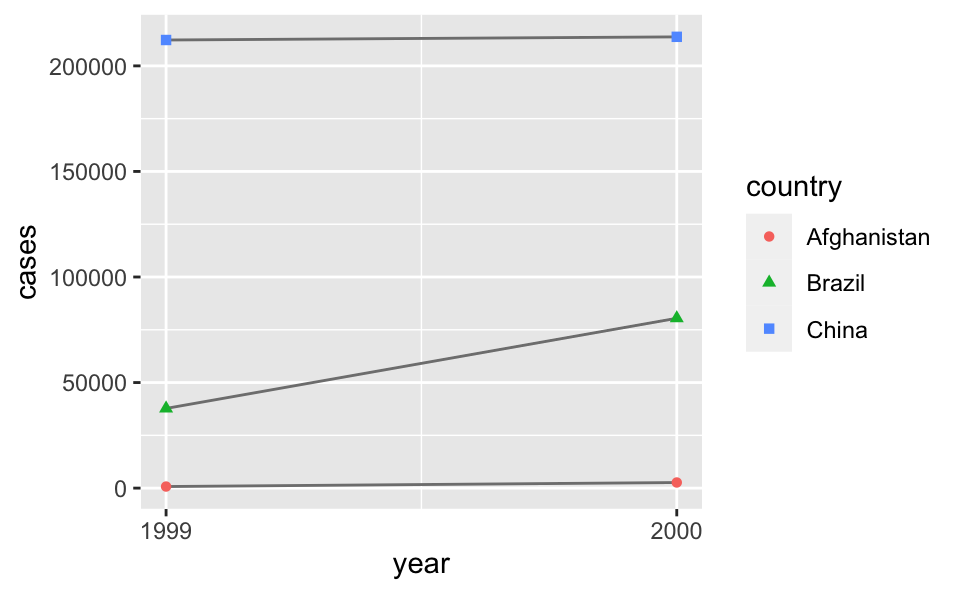

# 데이터 타이디하게 하기 {#data-tidy}

## 들어가기

> "행복한 가정은 모두 비슷하다. 불행한 가족은 자기 멋대로 불행하다." --- 레프 톨스토이

> "깔끔한 데이터셋은 모두 비슷하지만 엉망인 데이터셋은 자기 멋대로 엉망이다." --- 해들리 위컴 

이 장에서는 R에서 데이터를 일관성 있게 정리하는 법을 학습한다. 이는 타이디(tidy, 깔끔한) 데이터라는 구조이다. 타이디 데이터 형식으로 만들기 위해서는 일부 선행되는 작업이 필요하지만, 장기적으로 이러한 작업이 큰 도움이 된다. tidyverse의 패키지들에 있는 타이디 데이터와 도구를 사용하면 데이터를 기존 표현법에서 다른 표현법으로 훨씬 짧은 시간 안에 처리할 수 있고, 따라서 분석 문제를 다루는 일에 더 많은 시간을 쓸 수 있게 된다. 

이 장에서는 타이디 데이터에 대해 실무적으로 소개하고, **tidyr** 패키지에 포함된 도구를 살펴본다. 
Journal of Statistical Software 에 실린 [Tidy Data 논문](https://www.jstatsoft.org/article/view/v059i10) 에는 기본 이론에 대해 더 자세히 설명이 되어있다. 

### 준비하기

이 장에서는 지저분한 데이터셋을 정리하는 도구가 있는 **tidyr** 패키지에 중점을 둘 것이다. **tidyr** 은 tidyverse 의 핵심 구성요소로 포함되어 있다. 


```r
library(tidyverse)
```

## Tidy Data

하나의 기본 데이터를 표현하는 방식은 다양하다. 다음 예는 같은 데이터를 다른 네 가지 방식으로 구성하여 보여준다. 각 데이터셋은 country(국가), year(연도), population(인구) 및 cases(사례), 네 개의 변수 값을 동일하게 보여주지만 다른 방식으로 구성한다. 


```r
table1
#> # A tibble: 6 × 4
#>   country      year  cases population
#>   <chr>       <int>  <int>      <int>
#> 1 Afghanistan  1999    745   19987071
#> 2 Afghanistan  2000   2666   20595360
#> 3 Brazil       1999  37737  172006362
#> 4 Brazil       2000  80488  174504898
#> 5 China        1999 212258 1272915272
#> 6 China        2000 213766 1280428583
table2
#> # A tibble: 12 × 4
#>   country      year type           count
#>   <chr>       <int> <chr>          <int>
#> 1 Afghanistan  1999 cases            745
#> 2 Afghanistan  1999 population  19987071
#> 3 Afghanistan  2000 cases           2666
#> 4 Afghanistan  2000 population  20595360
#> 5 Brazil       1999 cases          37737
#> 6 Brazil       1999 population 172006362
#> # … with 6 more rows
table3
#> # A tibble: 6 × 3
#>   country      year rate             
#> * <chr>       <int> <chr>            
#> 1 Afghanistan  1999 745/19987071     
#> 2 Afghanistan  2000 2666/20595360    
#> 3 Brazil       1999 37737/172006362  
#> 4 Brazil       2000 80488/174504898  
#> 5 China        1999 212258/1272915272
#> 6 China        2000 213766/1280428583

# Spread across two tibbles
table4a  # cases
#> # A tibble: 3 × 3
#>   country     `1999` `2000`
#> * <chr>        <int>  <int>
#> 1 Afghanistan    745   2666
#> 2 Brazil       37737  80488
#> 3 China       212258 213766
table4b  # population
#> # A tibble: 3 × 3
#>   country         `1999`     `2000`
#> * <chr>            <int>      <int>
#> 1 Afghanistan   19987071   20595360
#> 2 Brazil       172006362  174504898
#> 3 China       1272915272 1280428583
```

이들은 모두 같은 데이터를 표현한 것이지만, 사용성이 같지는 않다. 타이디한 데이터셋만 tidyverse 내부에서 작업하기 훨씬 쉬울 것이다. 

데이터셋을 타이디하게 만드는, 서로 연관된 세 가지 규칙이 있다. 
 
1. 변수마다 해당되는 열이 있어야 한다.  
1. 관측값마다 해당되는 행이 있어야 한다. 
1. 값마다 해당하는 하나의 셀이 있어야 한다.  

Figure \@ref(fig:tidy-structure) 은 이러한 규칙을 시각적으로 보여준다. 

<div class="figure" style="text-align: center">

<p class="caption">(\#fig:tidy-structure)데이터셋을 타이디하게 만드는 세 가지 규칙: 변수는 열에 있고, 관측값은 행에 있고, 값은 셀에 있다.</p>
</div>

이 세 가지 규칙은 서로 연관되어 있다. 이 셋 중 두 가지만 충족시키는 것은 불가능하기 때문이다. 이 상호 관계때문에 다음과 같이 더 간단하고 실용적인 지침이 도출된다. 
 
1. 데이터셋을 티블에 각각 넣어라. 
1. 변수를 열에 각각 넣어라. 
 
위의 예에서는 table1 만 타이디하다. 이 테이블만 유일하게 각 열이 변수인 표현이다. 
 
데이터가 타이디해야 하는 이유는 무엇인가? 주요 장점은 두 가지이다. 
 
1. 데이터를 일관된 방식으로 저장하면 일반적으로 장점이 있다. 일관된 데이터 구조를 사용하면 이에 적용할 도구들이 공통성을 가지게 되어, 이들을 배우기가 더 쉬워진다. 

1. 변수를 열에 배치하면 R의 벡터화 속성이 가장 잘 발휘된다는 점에서 구체적인 장점이 있다. [뮤테이트](#mutate-funs) 와 [요약함수](#summary-funs) 에서 배웠겠지만, 대부분의 내장 R 함수는 벡터에 작동한다. 이러한 성질 때문에 타이디 데이터로 작업하는 것이 더 자연스럽게 된다. 
 
**dplyr, ggplot2** 를 비롯한 tidyverse 의 모든 패키지는 타이디 데이터로 동작하도록 설계되었다. 다음은 `table1` 을 사용하여 작업하는 방법을 보여주는 몇 가지 간단한 예제이다. 


```r
# Compute rate per 10,000
table1 %>% 
  mutate(rate = cases / population * 10000)
#> # A tibble: 6 × 5
#>   country      year  cases population  rate
#>   <chr>       <int>  <int>      <int> <dbl>
#> 1 Afghanistan  1999    745   19987071 0.373
#> 2 Afghanistan  2000   2666   20595360 1.29 
#> 3 Brazil       1999  37737  172006362 2.19 
#> 4 Brazil       2000  80488  174504898 4.61 
#> 5 China        1999 212258 1272915272 1.67 
#> 6 China        2000 213766 1280428583 1.67

# Compute cases per year
table1 %>% 
  count(year, wt = cases)
#> # A tibble: 2 × 2
#>    year      n
#>   <int>  <int>
#> 1  1999 250740
#> 2  2000 296920

# Visualise changes over time
library(ggplot2)
ggplot(table1, aes(year, cases)) + 
  geom_line(aes(group = country), colour = "grey50") + 
  geom_point(aes(colour = country, shape = country)) +
  scale_x_continuous(breaks = c(1999, 2000))
```



### 연습문제

1. 변수와 관측값이 각 샘플 테이블에서 어떻게 구성되어 있는지 설명하라. 

1. `table2` 와 `table4a + table4b` 에서 비율(`rate`)을 계산하라. 다음의 네 가지 작업을 수행해야 한다. 

    1. 연도별, 국가별로 결핵 사례수(case)를 추출하라.   

    1. 연도별, 국가별로 해당하는 인구를 추출하라. 

    1. 사례수를 인구로 나누고 10,000 을 곱하라. 

    1. 적절한 곳에 다시 저장하라.  

1. 가장 쉬운 표현법은 무엇인가? 어느 것이 가장 어려운가? 이유는? 

1. `table1`  대신 `table2` 를 사용하여 시간 경과에 따른 사례수의 변화를 보여주는 플롯을 재생성하라. 먼저 무엇을 해야 하는가? 

## 피봇팅

타이디 데이터의 원리는 너무 당연해 보여서, 과연 타이디하지 않은 데이터셋을 볼 일은 있을지 의문이 들 것이다. 하지만, 불행하게도 여러분이 마주치게 될 대부분의 데이터는 타이디하지 않을 것이다. 크게 두 가지 이유가 있다. 

1.  대부분의 사람들은 타이디 데이터의 원리에 익숙하지 않으며, 데이터 작업에 많은 시간을 써야만 타이디 데이터로 만들 수 있다. 

1. 데이터는 분석보다는 다른 용도에 편리하도록 구성되는 경우가 많다. 예를 들어 데이터는 가능한 한 쉽게 입력할 수 있도록 구성되기도 한다. 
 
따라서, 대부분의 실제 분석에서는 타이디하게 만드는 작업이 필요하다. 첫번째 단계는 항상 변수와 관측값이 무엇인지 파악하는 것이다. 이 작업이 쉬울 때도 있지만, 어떤 경우에는 데이터를 처음 생성한 사람들과 상의해야 할 수도 있다. 두 번째 단계는 자주 일어나는 다음의 두 가지 문제 중 하나를 해결하는 것이다. 

1. 하나의 변수가 여러 열에 분산되어 있을 수 있다. 
1. 하나의 관측값이 여러 행에 흩어져 있을 수 있다. 

일반적으로 데이터셋은 위 두가지 문제중 하나를 가지고 있을 것이다; 정말 행운이 없는 경우에는 두 문제 다 가지게 되고, tidyr 에 있는 가장 중요한 함수, `pivot_longer()` 와 `pivot_wider()` 가 필요하게 될 것이다. 

### Longer

자주 생기는 문제는 데이터셋의 일부 열 이름이 변수 이름이 아니라 변수 값인 경우이다. `table4a` 를 보면 열 이름 1999 와 2000 은 `year` 변수 값을 나타내며, 각 행은 하나가 아닌 두 개의 관측값을 나타낸다. 


```r
table4a
#> # A tibble: 3 × 3
#>   country     `1999` `2000`
#> * <chr>        <int>  <int>
#> 1 Afghanistan    745   2666
#> 2 Brazil       37737  80488
#> 3 China       212258 213766
```

이와 같은 데이터셋을 타이디하게 만들려면 해당 열을 새로운 두 변수로 피봇**(pivot)** 해야 한다. 이 작업을 설명하기 위해 세 가지 파라미터가 필요하다.

* 변수가 아니라 값을 나타내는 열 집합. 이 예에서는 열 `1999` 과 열 `2000` 이다.

* 열 이름 자리에 나타난 값의 변수 이름. 이를 나는 `key` 라고 부르며, 여기에서는 `year` 이다.

* 셀에 값이 분산되어 있는 변수의 이름. 이를 나는 `value` 라고 부르며, 여기에서는 `cases` (사례수) 이다.
 
이러한 파라미터와 함께 `pivot_longer()` 호출을 생성할 수 있다.


```r
table4a %>% 
  pivot_longer(c(`1999`, `2000`), names_to = "year", values_to = "cases")
#> # A tibble: 6 × 3
#>   country     year   cases
#>   <chr>       <chr>  <int>
#> 1 Afghanistan 1999     745
#> 2 Afghanistan 2000    2666
#> 3 Brazil      1999   37737
#> 4 Brazil      2000   80488
#> 5 China       1999  212258
#> 6 China       2000  213766
```

수집하고자 하는 열을 지정하는 법은 `dplyr::select()` 스타일 표기법을 따른다. 여기에는 두 개의 열만 있으므로 개별적으로 나열한다. ’1999’ 와 ’2000’ 은 구문론적 이름이 아니므로 (즉, 문자로 시작하지 않으므로) 역따옴표로 둘러쌓아야 함을 주목하라. 열을 선택하는 다른 방법에 대해 기억이 나지 않는다면 \@ref(select) 을 참조하라.

`year`, `cases` 는 `table4a` 에 있지 않아서 이 이름들을 `names_to`, `values_to` 인수로 지정할 때 따옴표를 사용한다.

최종 결과에서, 수집된 열은 삭제되고 새 `key` 와 `value` 열이 생성된다. 한편, 원래 변수 간의 관계는 보존된다. 이는 Figure \@ref(fig:tidy-pivot-longer) 에 시각적으로 표현되어 있다. 

<div class="figure" style="text-align: center">

<p class="caption">(\#fig:tidy-pivot-longer)`table4` 을 더 긴  타이티 형태로 피봇팅하기</p>
</div>

하지만 이슈가 하나 남았다.
`year` 변수 유형을 살펴보자.
`year` 가 수치형 (혹은 구체적으로는, 정수형) 이어야 하지만, 문자형으로 나타나고 있다.
`year` 변수의 값이 `table4a` 의 헤딩으로 부터 왔기 때문이다.
`readr::parse_integer()` 로 이 변수를 정수형으로 파싱하는 `dplyr::mutate()` 단계를 파이프라인에 추가할 수 있다.
다른 유형의 벡터를 파싱하기 위한 함수는 섹션 \@ref(parsing-a-vector) 을 참고하라.


```r
table4a %>%
  pivot_longer(
    cols = c(`1999`, `2000`),
    names_to = "year",
    values_to = "cases"
  ) %>%
  mutate(year = parse_integer(year))
#> # A tibble: 6 × 3
#>   country      year  cases
#>   <chr>       <int>  <int>
#> 1 Afghanistan  1999    745
#> 2 Afghanistan  2000   2666
#> 3 Brazil       1999  37737
#> 4 Brazil       2000  80488
#> 5 China        1999 212258
#> 6 China        2000 213766
```

더 긴 포맷으로 데이터를 만들었다면, 다음과 같이 지금의 정리 연습을 하게 한 시각화를 생성할 수 있다.


`pivot_longer` 를 사용하면 행 개수를 늘리고 열 개수를 줄여서 데이터셋을 길게 만든다. 나는 데이터셋이 "long form" 이라고 표현하는 것이 맞지 않는다고 믿는다. 길이는 상대적인 용어이고, (예를 들어) 데이터셋 A 가 데이터셋 B 보다 더 길다고만 이야기 할 수 있는 것이다.

`table4b` 를 비슷한 방법으로 타이디하게 할 때 `pivot_longer()` 를 사용할 수 있다. 유일한 차이점은 셀 값에 저장된 변수이다.


```r
table4b %>%
  pivot_longer(
    cols = c(`1999`, `2000`),
    names_to = "year",
    values_to = "population"
  ) %>%
  mutate(year = parse_integer(year))
#> # A tibble: 6 × 3
#>   country      year population
#>   <chr>       <int>      <int>
#> 1 Afghanistan  1999   19987071
#> 2 Afghanistan  2000   20595360
#> 3 Brazil       1999  172006362
#> 4 Brazil       2000  174504898
#> 5 China        1999 1272915272
#> 6 China        2000 1280428583
```

타이디하게 된 `table4a` 와 `table4b`을 하나의 티블로 결합하려면 `dplyr::left_join()` 을 사용해야 한다. 이 내용은 [관계형 데이터](#relational-data) 에서 다룰 것이다.


```r
tidy4a <- table4b %>%
  pivot_longer(
    cols = c(`1999`, `2000`),
    names_to = "year",
    values_to = "cases"
  ) %>%
  mutate(year = parse_integer(year))
tidy4b <- table4b %>%
  pivot_longer(
    cols = c(`1999`, `2000`),
    names_to = "year",
    values_to = "population"
  ) %>%
  mutate(year = parse_integer(year))
left_join(tidy4a, tidy4b)
#> Joining, by = c("country", "year")
#> # A tibble: 6 × 4
#>   country      year      cases population
#>   <chr>       <int>      <int>      <int>
#> 1 Afghanistan  1999   19987071   19987071
#> 2 Afghanistan  2000   20595360   20595360
#> 3 Brazil       1999  172006362  172006362
#> 4 Brazil       2000  174504898  174504898
#> 5 China        1999 1272915272 1272915272
#> 6 China        2000 1280428583 1280428583
```

### Wider

`pivot_wider()` 은  `pivot_longer()` 의 반대이다. 관측값이 여러 행에 흩어져 있을 때 사용한다. 예를 들어 `table2` 를 보자. 하나의 관측값은 한 해, 한 국가에 대한 것이지만, 각 관측값이 두 행에 흩어져 있다.


```r
table2
#> # A tibble: 12 × 4
#>   country      year type           count
#>   <chr>       <int> <chr>          <int>
#> 1 Afghanistan  1999 cases            745
#> 2 Afghanistan  1999 population  19987071
#> 3 Afghanistan  2000 cases           2666
#> 4 Afghanistan  2000 population  20595360
#> 5 Brazil       1999 cases          37737
#> 6 Brazil       1999 population 172006362
#> # … with 6 more rows
```

주어진 연도의 각 국가별 `rate` (`cases` 를 `population` 로 나눈 값) 을 계산해서 새로운 열에 기록하여 다음의 데이터프레임을 만든다고 해보자:


```
#> # A tibble: 6 × 5
#>   country      year  cases population      rate
#>   <chr>       <int>  <int>      <int>     <dbl>
#> 1 Afghanistan  1999    745   19987071 0.0000373
#> 2 Afghanistan  2000   2666   20595360 0.000129 
#> 3 Brazil       1999  37737  172006362 0.000219 
#> 4 Brazil       2000  80488  174504898 0.000461 
#> 5 China        1999 212258 1272915272 0.000167 
#> 6 China        2000 213766 1280428583 0.000167
```

`cases` 와 `population` 을 각각 열로 가지고, 이 열의 각 셀이 관련된 `count` 값을 가지는 데이터프레임이 필요하다는 말이다.
`pivot_longer()` 와 비슷한 방식으로 표현방법을 분석해 보자. 그러나 이번에는 파라미터가 두 개만 필요하다.

* 변수 이름을 포함하는 열, 여기에서는 `type` 이다.

* 값을 포함하는 열, 여기에서는 `count` 이다.

이 파라미터들을 정하면 `pivot_wider()` 를 사용할 수 있다. 코드로는 아래에서 보여주고, 시각적으로는 Figure \@ref(fig:tidy-pivot-wider) 에서 보여주고 있다.


```r
table2 %>%
    pivot_wider(names_from = type, values_from = count)
#> # A tibble: 6 × 4
#>   country      year  cases population
#>   <chr>       <int>  <int>      <int>
#> 1 Afghanistan  1999    745   19987071
#> 2 Afghanistan  2000   2666   20595360
#> 3 Brazil       1999  37737  172006362
#> 4 Brazil       2000  80488  174504898
#> 5 China        1999 212258 1272915272
#> 6 China        2000 213766 1280428583
```

<div class="figure" style="text-align: center">

<p class="caption">(\#fig:tidy-pivot-wider)`table2` 을 더 넓은 타이티 형태로 피봇팅하기</p>
</div>

더 넓은 포맷으로 데이터를 만들었다면, 이제 다음과 같이 정리하는 예제를 해볼 수 있는 데이터프레임을 생성할 수 있다.


```r
table2 %>%
  pivot_wider(names_from = type, values_from = count) %>%
  mutate(rate = cases / population)
#> # A tibble: 6 × 5
#>   country      year  cases population      rate
#>   <chr>       <int>  <int>      <int>     <dbl>
#> 1 Afghanistan  1999    745   19987071 0.0000373
#> 2 Afghanistan  2000   2666   20595360 0.000129 
#> 3 Brazil       1999  37737  172006362 0.000219 
#> 4 Brazil       2000  80488  174504898 0.000461 
#> 5 China        1999 212258 1272915272 0.000167 
#> 6 China        2000 213766 1280428583 0.000167
```

앞에서 연간 case 카운트를 시각화 했었고, 아래의 표현은 케이스 rate 을 시각화하는데 유용하다.


```r
table2 %>%
  pivot_wider(names_from = type, values_from = count) %>%
  mutate(rate = cases / population) %>%
  ggplot(aes(x = year, y = rate)) +
  geom_line(aes(group = country), colour = "grey50") +
  geom_point(aes(colour = country, shape = country)) +
  scale_x_continuous(breaks = c(1999, 2000))
```


이제 한 걸음 더 나아가서 데이터를 더 넓게 하여 1999 년과 2000 년의 `cases`, `population`, `rate` 를 다음과 같이 개별 열에 기록해 보자.


```
#> # A tibble: 3 × 7
#>   country     cases_1999 population_1999 rate_1999 cases_2000 population_2000
#>   <chr>            <int>           <int>     <dbl>      <int>           <int>
#> 1 Afghanistan        745        19987071 0.0000373       2666        20595360
#> 2 Brazil           37737       172006362 0.000219       80488       174504898
#> 3 China           212258      1272915272 0.000167      213766      1280428583
#> # … with 1 more variable: rate_2000 <dbl>
```

이러한 표현법은 데이터 분석에 유용하지는 않지만 데이터 분석 리포트의 결과를 가지고 커뮤니케이션하기 위한 기초 테이블 용도로는 유용할 수 있다.

이를 위해 우리는 `cases`, `population`, `rate` 열 헤드에서 연도를 추가할 필요가 있고, 이러한 세 열에 있는 값을 여섯 열로 분산시켜야 할 필요가 있다 (데이터가 있는 연도마다 두 열).
이는 Figure \@ref(fig:tidy-pivot-even-wider) 에 표현이 되어 있다.

<div class="figure" style="text-align: center">

<p class="caption">(\#fig:tidy-pivot-even-wider)Pivoting `table2` into an even "wider" form. Arrows for `cases` and `rate` values are omitted for clarity.</p>
</div>

이를 위해, 피봇 함수를 한 번에 여러 열에 동작 시킬수 있다는 장점을 활용해 보자.
다음 코드 청크의 첫 세 라인은 우리가 이미 앞 단계에서 했던 것이고, 다른 `pivot_wider()` 단계를 추가한다. 이 단계에서 추가열을 `cases`, `population`, `rate` 에서 추출하고 열 이름들은 `year` 변수의 값으로 자동으로 꼬리가 달리게 한다.


```r
table2 %>%
  pivot_wider(names_from = type, values_from = count) %>%
  mutate(rate = cases / population) %>%
  pivot_wider(
    names_from = year,
    values_from = c(cases, population, rate)
  )
#> # A tibble: 3 × 7
#>   country     cases_1999 cases_2000 population_1999 population_2000 rate_1999
#>   <chr>            <int>      <int>           <int>           <int>     <dbl>
#> 1 Afghanistan        745       2666        19987071        20595360 0.0000373
#> 2 Brazil           37737      80488       172006362       174504898 0.000219 
#> 3 China           212258     213766      1272915272      1280428583 0.000167 
#> # … with 1 more variable: rate_2000 <dbl>
```

마지막 단계는 결과 데이터프레임에서 열들을 이동시켜 1999 년 데이터가 2000 년 데이터보다 앞서 나오도록 하는 것이다. `relocate()` 함수를 사용하여 1999 열을 2000 열 앞에 오도록 할 수 있다.


```r
table2 %>%
  pivot_wider(names_from = type, values_from = count) %>%
  mutate(rate = cases / population) %>%
  pivot_wider(
    names_from = year,
    values_from = c(cases, population, rate)
  ) %>%
  relocate(country, contains("1999"))
#> # A tibble: 3 × 7
#>   country     cases_1999 population_1999 rate_1999 cases_2000 population_2000
#>   <chr>            <int>           <int>     <dbl>      <int>           <int>
#> 1 Afghanistan        745        19987071 0.0000373       2666        20595360
#> 2 Brazil           37737       172006362 0.000219       80488       174504898
#> 3 China           212258      1272915272 0.000167      213766      1280428583
#> # … with 1 more variable: rate_2000 <dbl>
```

이름을 통해 이미 알아 차린 사람도 있겠지만, `pivot_wider()` 와 `pivot_longer()` 는 대칭 관계이다. `pivot_longer()` 는 넓은 테이블을 더 좁고 길게, `pivot_longer()` 는 긴 테이블을 더 짧고 넓게 만든다.

### 연습문제

1.  `pivot_longer()` 와 `pivot_wider()` 가 완벽하게 대칭이 아닌 이유는 무엇인가? 다음 예제를 주의 깊게 살펴보라.

    
    ```r
    stocks <- tibble(
      year   = c(2015, 2015, 2016, 2016),
      half  = c(   1,    2,     1,    2),
      return = c(1.88, 0.59, 0.92, 0.17)
    )
    stocks %>% 
      pivot_wider(names_from = year, values_from = return) %>% 
      pivot_longer(`2015`:`2016`, names_to = "year", values_to = "return")
    ```
    
    (힌트: 변수 유형을 보고 열 이름에 대해 생각해보라.)
    
    `pivot_longer()` 는 `names_ptype` 인수, 예를 들어 `names_ptype = list(year = double())` 가 있다. 어떤 역할을 하는가?

1.  이 코드가 작동하지 않는 이유는 무엇인가?

    
    ```r
    table4a %>% 
      pivot_longer(c(1999, 2000), names_to = "year", values_to = "cases")
    #> Error: Can't subset columns that don't exist.
    #> x Locations 1999 and 2000 don't exist.
    #> ℹ There are only 3 columns.
    ```

1.  티블을 펼치는 다음의 코드는 왜 에러가 나는가? 새로운 열을 추가해서 어떻게 문제를 해결할 수 있는가?

    
    ```r
    people <- tribble(
      ~name,             ~key,    ~value,
      #-----------------|--------|------
      "Phillip Woods",   "age",       45,
      "Phillip Woods",   "height",   186,
      "Phillip Woods",   "age",       50,
      "Jessica Cordero", "age",       37,
      "Jessica Cordero", "height",   156
    )
    ```

1.  다음의 간단한 티블을 타이디하게 하라. 데이터셋을 길게 혹은 넓게할 필요가 있는가? 변수들은 무엇인가?

    
    ```r
    preg <- tribble(
      ~pregnant, ~male, ~female,
      "yes",     NA,    10,
      "no",      20,    12
    )
    ```


## 사례 연구

데이터를 타이디하게 만들기 위해 배운 것을 모두 정리하면서 이 장을 끝내자. `tidyr::who`  데이터셋에는 결핵(TB) 사례가 연도, 국가, 나이, 성별 및 진단 방법별로 세분화되어 있다. 이 데이터는 2014년 세계보건기구 전세계 결핵 보고서에 실렸으며, <http://www.who.int/tb/country/data/download/en/>에서 얻을 수 있다. 

이 데이터셋에는 역학 정보가 풍부하게 있지만, 제공된 데이터 형식으로 작업하는 것은 쉽지 않다.


```r
who
#> # A tibble: 7,240 × 60
#>   country   iso2  iso3   year new_sp_m014 new_sp_m1524 new_sp_m2534 new_sp_m3544
#>   <chr>     <chr> <chr> <int>       <int>        <int>        <int>        <int>
#> 1 Afghanis… AF    AFG    1980          NA           NA           NA           NA
#> 2 Afghanis… AF    AFG    1981          NA           NA           NA           NA
#> 3 Afghanis… AF    AFG    1982          NA           NA           NA           NA
#> 4 Afghanis… AF    AFG    1983          NA           NA           NA           NA
#> 5 Afghanis… AF    AFG    1984          NA           NA           NA           NA
#> 6 Afghanis… AF    AFG    1985          NA           NA           NA           NA
#> # … with 7,234 more rows, and 52 more variables: new_sp_m4554 <int>,
#> #   new_sp_m5564 <int>, new_sp_m65 <int>, new_sp_f014 <int>,
#> #   new_sp_f1524 <int>, new_sp_f2534 <int>, new_sp_f3544 <int>,
#> #   new_sp_f4554 <int>, new_sp_f5564 <int>, new_sp_f65 <int>,
#> #   new_sn_m014 <int>, new_sn_m1524 <int>, new_sn_m2534 <int>,
#> #   new_sn_m3544 <int>, new_sn_m4554 <int>, new_sn_m5564 <int>,
#> #   new_sn_m65 <int>, new_sn_f014 <int>, new_sn_f1524 <int>, …
```

이 데이터셋은 매우 전형적인 실데이터이다. 여기에는 열 중복, 이상한 가변 코드 및 다수의 결측값이 있다. 즉, `who`  데이터는 지저분해서 여러 단계를 통해 타이디하게 만들어야 한다. **dplyr** 처럼, **tidyr** 은 각 함수가 한 가지를 잘하도록 설계되었다. 따라서, 일반적으로 실제 상황에서는 여러 동사를 파이프라인으로 함께 연결해야 한다.

변수가 아닌 열을 모으는 것부터 시작하는 것이 대개 가장 좋다. 다음을 살펴보자.
 
* `country` , `iso2`  및 `iso3` 는 국가를 중복해서 지정하는 세 개의 변수이다.

* `year`  또한 분명히 변수이다.

* 다른 모든 열은 아직 무엇인지 알 수 없지만, 변수 이름 (예: `new_sp_m014` , `new_ep_m014` , `new_ep_f014` )의 구조를 보면 이들은 변수가 아닌 값일 가능성이 있다.

따라서 `new_sp_m014` 에서 `newrel_f65` 까지의 모든 열을 모을 필요가 있다. 그 값이 무엇을 나타내는지 아직 알지 못하기 때문에 일반 이름인 ’`key` ’라는 이름을 붙일 것이다. 셀이 사례수를 나타내는 것을 알고 있으므로 변수 `cases` 를 사용한다. 현재 표현에는 많은 결측값이 있으므로 `na.rm` 을 사용하여 있는 값에만 집중할 것이다.


```r
who1 <- who %>% 
  pivot_longer(
    cols = new_sp_m014:newrel_f65, 
    names_to = "key", 
    values_to = "cases", 
    values_drop_na = TRUE
  )
who1
#> # A tibble: 76,046 × 6
#>   country     iso2  iso3   year key          cases
#>   <chr>       <chr> <chr> <int> <chr>        <int>
#> 1 Afghanistan AF    AFG    1997 new_sp_m014      0
#> 2 Afghanistan AF    AFG    1997 new_sp_m1524    10
#> 3 Afghanistan AF    AFG    1997 new_sp_m2534     6
#> 4 Afghanistan AF    AFG    1997 new_sp_m3544     3
#> 5 Afghanistan AF    AFG    1997 new_sp_m4554     5
#> 6 Afghanistan AF    AFG    1997 new_sp_m5564     2
#> # … with 76,040 more rows
```

새로운 `key` 열의 값을 세어서 값의 구조에 대한 힌트를 얻을 수 있다.


```r
who1 %>% 
  count(key)
#> # A tibble: 56 × 2
#>   key              n
#>   <chr>        <int>
#> 1 new_ep_f014   1032
#> 2 new_ep_f1524  1021
#> 3 new_ep_f2534  1021
#> 4 new_ep_f3544  1021
#> 5 new_ep_f4554  1017
#> 6 new_ep_f5564  1017
#> # … with 50 more rows
```

머리를 굴려보고 몇 가지를 시도하면 나름대로 값의 구조를 분석할 수 있을 것이다. 하지만 다행스럽게도 우리는 데이터 사전을 써먹을 수 있다. 데이터 사전은 다음을 알려준다.
 
1. 각 열의 처음 세 글자는 해당 열이 포함하는 결핵 사례가, 새로운 사례인지 과거 사례인지를 나타낸다. 이 데이터셋에서 각 열은 새로운 사례를 포함한다.

1.  그 다음 두 글자는 다음의 결핵의 유형을 기술한다. 

    *   `rel` 은 재발 사례를 의미한다.
    *   `ep` 는 폐외 (extrapulmonary) 결핵 사례를 의미한다.
    *   `sn` 은 폐 얼룩으로 보이지 않는 폐결핵의 사례를 의미한다. (smear negative)             
    *   `sp` 는 폐 얼룩으로 보이는 폐결핵 사례를 의미한다. (smear positive)

1. 여섯 번째 글자는 결핵 환자의 성별을 나타낸다. 남성(`m` )과 여성(`f` )으로 사례를 분류한다.

1. 나머지 숫자는 연령대를 나타낸다. 다음의 7개 연령대로 사례를 분류한다.

    * 014 = 0-14세
    * 1524 = 15-24세 
    * 2534 = 25-34세 
    * 3544 = 35-44세 
    * 4554 = 45-54세 
    * 5564 = 55-64세 
    * 65 = 65세 이상
 
열 이름의 형식을 약간 수정해야 한다. 열 이름이 `new_rel` 이 아니라 `newrel` 이기 때문에 불행하게도 이름에 일관성이 없다. (여기에서 이를 발견해내기는 쉽지 않지만, 수정하지 않으면 이후에 에러가 발생한다.) [문자열]에서 `str_replace()` 에 대해 배우겠지만, 기본적인 아이디어는 간단하다. ’newrel‘ 문자를 ’new_rel‘ 문자로 바꾼다. 이렇게 하면 모든 변수 이름에서 일관성이 유지된다.


```r
who2 <- who1 %>% 
  mutate(key = stringr::str_replace(key, "newrel", "new_rel"))
who2
#> # A tibble: 76,046 × 6
#>   country     iso2  iso3   year key          cases
#>   <chr>       <chr> <chr> <int> <chr>        <int>
#> 1 Afghanistan AF    AFG    1997 new_sp_m014      0
#> 2 Afghanistan AF    AFG    1997 new_sp_m1524    10
#> 3 Afghanistan AF    AFG    1997 new_sp_m2534     6
#> 4 Afghanistan AF    AFG    1997 new_sp_m3544     3
#> 5 Afghanistan AF    AFG    1997 new_sp_m4554     5
#> 6 Afghanistan AF    AFG    1997 new_sp_m5564     2
#> # … with 76,040 more rows
```

각 코드의 값을 `separate()`  2회 실행하여 분리할 수 있다. 첫 번째 실행은 각 언더스코어마다 코드를 쪼갠다.


```r
who3 <- who2 %>% 
  separate(key, c("new", "type", "sexage"), sep = "_")
who3
#> # A tibble: 76,046 × 8
#>   country     iso2  iso3   year new   type  sexage cases
#>   <chr>       <chr> <chr> <int> <chr> <chr> <chr>  <int>
#> 1 Afghanistan AF    AFG    1997 new   sp    m014       0
#> 2 Afghanistan AF    AFG    1997 new   sp    m1524     10
#> 3 Afghanistan AF    AFG    1997 new   sp    m2534      6
#> 4 Afghanistan AF    AFG    1997 new   sp    m3544      3
#> 5 Afghanistan AF    AFG    1997 new   sp    m4554      5
#> 6 Afghanistan AF    AFG    1997 new   sp    m5564      2
#> # … with 76,040 more rows
```

그런 다음, `new` 열은 이 데이터셋에서 상수이므로 제거할 수 있다. 이 참에 `iso2` 와 `iso3` 도 중복이므로 함께 제거하자.


```r
who3 %>% 
  count(new)
#> # A tibble: 1 × 2
#>   new       n
#>   <chr> <int>
#> 1 new   76046
who4 <- who3 %>% 
  select(-new, -iso2, -iso3)
```

다음으로 `sexage` 를 `sex` 와 `age` 로 분리할 것이다.


```r
who5 <- who4 %>% 
  separate(sexage, c("sex", "age"), sep = 1)
who5
#> # A tibble: 76,046 × 6
#>   country      year type  sex   age   cases
#>   <chr>       <int> <chr> <chr> <chr> <int>
#> 1 Afghanistan  1997 sp    m     014       0
#> 2 Afghanistan  1997 sp    m     1524     10
#> 3 Afghanistan  1997 sp    m     2534      6
#> 4 Afghanistan  1997 sp    m     3544      3
#> 5 Afghanistan  1997 sp    m     4554      5
#> 6 Afghanistan  1997 sp    m     5564      2
#> # … with 76,040 more rows
```

자, 이제 `who`  데이터셋은 타이디해졌다!

여기에서 중간 결과를 새로운 변수에 할당하며, 코드를 한 번에 한 조각씩 보았었다. 이는 일반적인 대화식 작업 방식이 아니다. 대신 앞으로 다음과 같이 점차 복잡한 파이프를 만들게 될 것이다.


```r
who %>%
  pivot_longer(
    cols = new_sp_m014:newrel_f65, 
    names_to = "key", 
    values_to = "cases", 
    values_drop_na = TRUE
  ) %>% 
  mutate(
    key = stringr::str_replace(key, "newrel", "new_rel")
  ) %>%
  separate(key, c("new", "var", "sexage")) %>% 
  select(-new, -iso2, -iso3) %>% 
  separate(sexage, c("sex", "age"), sep = 1)
```

### 연습문제

1.  이 사례 연구에서 올바른 값을 가지고 있는지 쉽게 확인하기 위해 `values_drop_na = TRUE` 로 설정했다. 이것은 합리적인가? 이 데이터셋에서 결측값은 어떻게 표현될지 생각해 보라. 암묵적인 결측값이 있는가? `NA` 와 0 의 차이점은 무엇인가?

1. `mutate()` 단계를 무시하면 어떻게 되는가? (`mutate(key = stringr::str_replace(key, "newrel", "new_rel"))`).

1. 앞서 주장한, `iso2` 와 `iso3` 가 `country` 와 중복된다는 것을 확인하라.

1. 각 `country, year`  및 `sex` 에 대해 총 결핵 사례수를 계산하라. 정보를 시각적으로 보여라.

## 타이디하지 않은 데이터

다른 주제로 넘어 가기 전에 타이디하지 않은 데이터에 대해 간단히 이야기 해보자. 이 장의 앞부분에서 타이디하지 않은 데이터를 의미하기 위해 부정적인 용어인 ’지저분한’을 사용했다. 이는 과도하게 단순화한 것이다. 타이디 데이터가 아니더라도 유용하고 잘 구성된, 많은 데이터 구조가 있다. 다른 데이터 구조를 사용하는 데는 주된 이유가 두 가지이다.

* 다른 표현 방식이 성능상, 저장용량상 장점이 클 수 있다.

* 전문 분야에서 독자적으로 진화시킨 데이터 저장 규칙이 타이디 데이터의 규칙과는 꽤 다를 수 있다.

이런 이유로 인해 티블(또는 데이터프레임)이 아닌 다른 것이 필요해진다. 데이터가 관측값과 변수로 구성된 직사각형 구조에 자연스럽게 맞아떨어진다면 타이디 데이터가 기본 선택이어야 한다고 생각한다. 그러나 다른 구조를 사용하는 데도 그럴만한 충분한 이유가 있다. 타이디 데이터만이 유일한 방법은 아니다. 타이디하지 않은 데이터에 대해 더 자세히 알고 싶다면 제프 릭(Jeff Leek)의 깊이 있는 [블로그 게시물](http://simplystatistics.org/2016/02/17/non-tidy-data) 을 적극 추천한다. 
