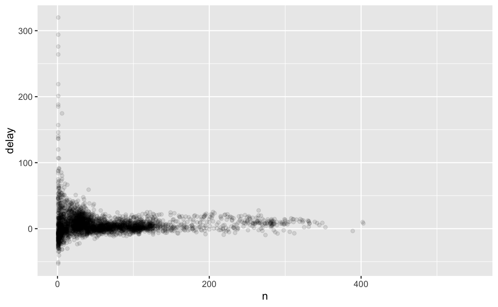
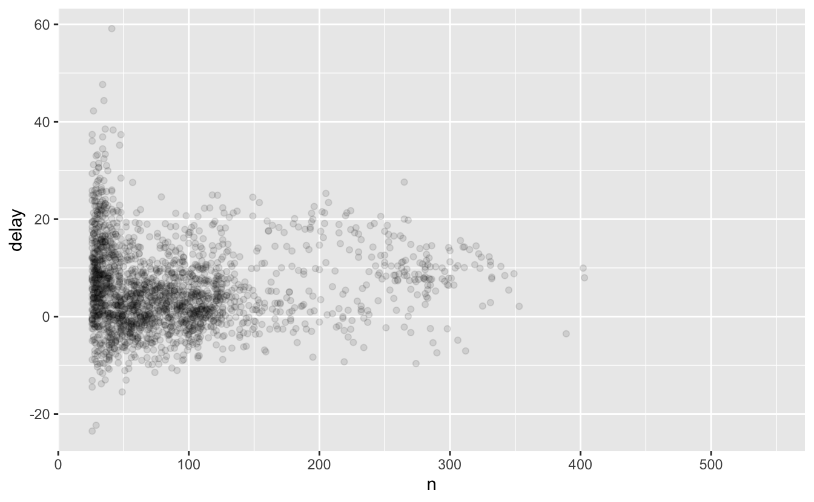
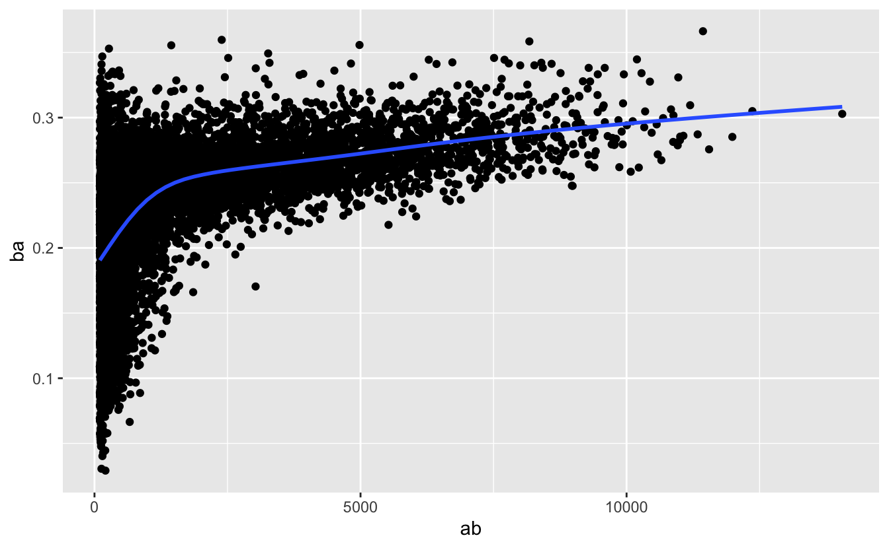

# 데이터 변환 {#data-transform}

## 들어가기

시각화는 직관을 얻을 수 있는 중요한 도구이다. 하지만 데이터가 정확히 필요한 형태를 취하는 경우는 거의 없다. 데이터를 좀 더 쉽게 사용할 수 있도록 새로운 변수나 요약값을 만들어야 할 수도 있고, 아니면 변수 이름을 변경하거나
관측값들을 재정렬해야 되는 경우가 종종 있다. 이 장에서 이 모든 것(과 그 이상!)을 배울 것인데, dplyr 패키지와 2013년 뉴욕시 출발 항공편 데이터셋을 이용하여 데이터 변환 방법을 배워보자.

### 준비하기

이 장에서 우리는 tidyverse의 또 다른 핵심 구성원인 dplyr 패키지를 사용하는
법에 집중할 것이다. nycflights13 패키지의 데이터를 이용하여 핵심 아이디어를
배우고, ggplot2를 이용하여 데이터를 이해해볼 것이다.


```r
library(nycflights13)
library(tidyverse)
#> ── Attaching packages ─────────────────────────────────────── tidyverse 1.3.0 ──
#> ✓ ggplot2 3.3.5     ✓ purrr   0.3.4
#> ✓ tibble  3.1.5     ✓ dplyr   1.0.7
#> ✓ tidyr   1.1.4     ✓ stringr 1.4.0
#> ✓ readr   1.4.0     ✓ forcats 0.5.1
#> ── Conflicts ────────────────────────────────────────── tidyverse_conflicts() ──
#> x dplyr::filter() masks stats::filter()
#> x dplyr::lag()    masks stats::lag()
```

tidyverse를 로드할 때 출력되는 충돌 메시지를 조심히 살펴보라. dplyr이 베이스 R 함수 몇 개를 덮어쓴다고 알려준다. dplyr를 로딩한 후 이 함수들의 베이스
버전을 사용하고 싶다면 `stats::filter()`, `stats::lag()` 와 같이 전체 이름을
사용해야 한다.

### nycflights13

dplyr의 기본 데이터 작업(manipulation) 동사를 탐색하기 위해서 `nycflights13::flights` 를 사용할 것이다. 이 데이터프레임에는 뉴욕시에서 2013년에 출발한
336,776 편의 모든 항공편이 포함되어 있다. 데이터의 출처는 [Bureau of Transportation Statistics](http://www.transtats.bts.gov/DatabaseInfo.asp?DB_ID=120&Link=0)이며 `?flights` 에 문서화되어 있다.


```r
flights
#> # A tibble: 336,776 × 19
#>    year month   day dep_time sched_dep_time dep_delay arr_time sched_arr_time
#>   <int> <int> <int>    <int>          <int>     <dbl>    <int>          <int>
#> 1  2013     1     1      517            515         2      830            819
#> 2  2013     1     1      533            529         4      850            830
#> 3  2013     1     1      542            540         2      923            850
#> 4  2013     1     1      544            545        -1     1004           1022
#> 5  2013     1     1      554            600        -6      812            837
#> 6  2013     1     1      554            558        -4      740            728
#> # … with 336,770 more rows, and 11 more variables: arr_delay <dbl>,
#> #   carrier <chr>, flight <int>, tailnum <chr>, origin <chr>, dest <chr>,
#> #   air_time <dbl>, distance <dbl>, hour <dbl>, minute <dbl>, time_hour <dttm>
```

R 을 사용해본 독자라면 이 데이터프레임은 이전에 사용했던 데이터프레임과 조금 다르게 출력되는 것을 알아차렸을 것이다. 데이터가 **티블(tibble)** 이기 때문인데, tidyverse 팀에서 data.frame 의 불편한 점을 피하기 위해 고안한 특수한 종류의 데이터프레임이다. 
가장 중요한 차이는 출력하는 방법에 있다. 티블은 큰 데이터셋을 위해 설계되었기 때문에 처음 몇 행과 한 화면에 들어갈 개수의 열만 표시된다. 
데이터셋 전체를 보려면 `View(flights)` 를 실행하여 RStudio 뷰어에서 데이터셋을 열 수 있다.
다른 중요한 차이점들은 \@ref(tibbles) 장에서 살펴볼 것이다.

열 이름 아래의 세 글자(또는 네 글자) 줄임말 행을 봤을 것이다. 이는 각 변수의 유형을 설명한다.


-   `int` 는 정수(integer).

-   `dbl` 은 더블형(double), 즉 실수.

-   `chr` 는 문자형(character) 벡터.

-   `dttm` 은 데이트-타임형(날짜 + 시간).

이 데이터셋에서 사용되지 않은 세 가지 일반적인 변수 유형이 있는데 이 책 뒤에서 살펴볼 것이다.

-   `lgl` 은 `TRUE` 나 `FALSE` 만 포함하는 벡터인 논리형(logical).

-   `fctr` 는 팩터형을 의미하는데, R 은 이를 이용하여 가능한 값이 미리 정해진 범주형 변수를 나타냄. 

-   `date` 는 데이트형.

### dplyr 기초

이 장에서는 데이터 작업 문제 대부분을 풀 수 있는 핵심 dplyr 동사들을 배울 것이다. 이러한 함수들은 네가지 종류로 정리할 수 있다:

  -   **행(rows)** 에 작동하는 함수들: `filter()` 는 열의 값을 기준으로 행들을 서브셋하고, `slice()` 와 이웃함수들은 행의 위치를 기준으로 서브셋하고, `arrange()` 는 행의 순서를 바꾼다.

-   **열(columns)** 에 작동하는 함수들: `mutate()` 는 새 열을 생성하고, `select()` 는 열을 선택하고, `rename()` 은 열의 이름을 바꾸고, `relocate()` 은 열의 위치를 바꾼다.

-   **그룹(groups)** 에 작동하는 함수들: `group_by()` 는 분석을 위해 데이터를 그룹으로 나누고 `summarise()` 는 각 그룹을 하나의 행으로 요약한다.

조인 함수나 집합연산과 같이 **테이블(tables)** 에 작동하는 동사들에 대해서도 \@ref(relational-data) 장에서 배울 것이다.

모든 dplyr 동사들은 비슷하게 작동한다:

1.  첫번째 인수는 데이터프레임이다.

2.  그 이후의 인수들은 (따옴표가 없는) 변수 이름을 사용하여 데이터프레임에
무엇을 할지를 설명한다.

3.  겨로가는 새로운 데이터프레임이다.

이 속성들을 함께 이용하면 여러 단순한 단계를 쉽게 연결하여 복잡한 결과를
얻을 수 있다. 이 동사들이 어떻게 작동하는지 좀 더 살펴보자.

## 행

아래의 함수들은 행 (관측값들) 에 영향을 주지만 열 (변수들) 에는 변화를 주지 않는다.
`filter()` 는 순서를 변화시키지 않고 어떤 행이 포함될지를 결정하고, `arrange()` 는 멤버십을 변화시키지 않으면서 순서만 바꾼다.

### `filter()`

`filter()` 를 이용하면 값을 기준으로 데이터를 서브셋 할 수 있다[^data-transform-1].
첫 번째 인수는 데이터프레임 이름이다. 두 번째 이후의 인수들은 데이터프레임을 필터링하는
표현식들이다. 예를 들어 1월 1일 항공편 모두를 다음과 같이 선택할 수 있다.

  [^data-transform-1]: Later, you'll learn about the `slice_*()` family which allows you to choose rows based on their positions


```r
filter(flights, month == 1, day == 1)
#> # A tibble: 842 × 19
#>    year month   day dep_time sched_dep_time dep_delay arr_time sched_arr_time
#>   <int> <int> <int>    <int>          <int>     <dbl>    <int>          <int>
#> 1  2013     1     1      517            515         2      830            819
#> 2  2013     1     1      533            529         4      850            830
#> 3  2013     1     1      542            540         2      923            850
#> 4  2013     1     1      544            545        -1     1004           1022
#> 5  2013     1     1      554            600        -6      812            837
#> 6  2013     1     1      554            558        -4      740            728
#> # … with 836 more rows, and 11 more variables: arr_delay <dbl>, carrier <chr>,
#> #   flight <int>, tailnum <chr>, origin <chr>, dest <chr>, air_time <dbl>,
#> #   distance <dbl>, hour <dbl>, minute <dbl>, time_hour <dttm>
```

해당 코드 라인을 실행하면 dplyr 은 필터링 연산을 실행하고 새로운 데이터프레임을 반환한다. dplyr 함수들은 입력을 절대 수정하지 않기 때문에, 결과를 저장하려면 할당 연산자 `<-` 를 사용해야 한다.


```r
jan1 <- filter(flights, month == 1, day == 1)
```

필터링을 효과적으로 사용하기 위해서는, 비교 연산자들을 사용하여 관측값을 선택하는 방법을 알아야한다.
R 은 표준 스위트를 제공한다: `>`, `>=`, `<`, `<=`, `!=` (not equal), and `==` (equal).
`%in%` 도 제공한다: `filter(df, x %in% c(a, b, c))` 는 `x` 가 `a` 이거나, `b` 이거나, `c` 인 모든 행을 반환한다.

R 을 배우기 시작할 때 가장 범하기 쉬운 실수는, 같음을 테스트할 때 `==` 대신 `=` 를 사용하는 것이다. 이런 실수를 하면 `filter()` 는 해당 내용을 알려준다.


```r
filter(flights, month = 1)
#> Error: Problem with `filter()` input `..1`.
#> x Input `..1` is named.
#> ℹ This usually means that you've used `=` instead of `==`.
#> ℹ Did you mean `month == 1`?
```

### `arrange()`

`arrange()` 는 `filter()` 와 비슷하게 작동하는데, 차이점은 행을 선택하는 대신 행의 순서를 바꾼다.
데이터프레임과 순서의 기준으로 삼을 열 이름 (혹은 더 복잡한 표현식) 을 입력으로 한다.
열 이름이 하나 이상 입력된다면 추가된 열은 이전 열 값 동전값(tie) 상황을 해결하는 데에 사용된다.


```r
arrange(flights, year, month, day)
#> # A tibble: 336,776 × 19
#>    year month   day dep_time sched_dep_time dep_delay arr_time sched_arr_time
#>   <int> <int> <int>    <int>          <int>     <dbl>    <int>          <int>
#> 1  2013     1     1      517            515         2      830            819
#> 2  2013     1     1      533            529         4      850            830
#> 3  2013     1     1      542            540         2      923            850
#> 4  2013     1     1      544            545        -1     1004           1022
#> 5  2013     1     1      554            600        -6      812            837
#> 6  2013     1     1      554            558        -4      740            728
#> # … with 336,770 more rows, and 11 more variables: arr_delay <dbl>,
#> #   carrier <chr>, flight <int>, tailnum <chr>, origin <chr>, dest <chr>,
#> #   air_time <dbl>, distance <dbl>, hour <dbl>, minute <dbl>, time_hour <dttm>
```

`desc()` 을 사용하면 내림차순 (descending order) 으로 정렬한다:


```r
arrange(flights, desc(dep_delay))
#> # A tibble: 336,776 × 19
#>    year month   day dep_time sched_dep_time dep_delay arr_time sched_arr_time
#>   <int> <int> <int>    <int>          <int>     <dbl>    <int>          <int>
#> 1  2013     1     9      641            900      1301     1242           1530
#> 2  2013     6    15     1432           1935      1137     1607           2120
#> 3  2013     1    10     1121           1635      1126     1239           1810
#> 4  2013     9    20     1139           1845      1014     1457           2210
#> 5  2013     7    22      845           1600      1005     1044           1815
#> 6  2013     4    10     1100           1900       960     1342           2211
#> # … with 336,770 more rows, and 11 more variables: arr_delay <dbl>,
#> #   carrier <chr>, flight <int>, tailnum <chr>, origin <chr>, dest <chr>,
#> #   air_time <dbl>, distance <dbl>, hour <dbl>, minute <dbl>, time_hour <dttm>
```

### Exercises

1.  Find all flights that

    a.  Had an arrival delay of two or more hours
    b.  Flew to Houston (`IAH` or `HOU`)
    c.  Were operated by United, American, or Delta
    d.  Departed in summer (July, August, and September)
    e.  Arrived more than two hours late, but didn't leave late
f.  Were delayed by at least an hour, but made up over 30 minutes in flight
g.  Departed between midnight and 6am (inclusive)

2.  Sort `flights` to find the flights with longest departure delays.
Find the flights that left earliest.

3.  Sort `flights` to find the fastest (highest speed) flights.
(Hint: try sorting by a calculation).

4.  Which flights travelled the farthest?
  Which travelled the shortest?

## 열

아래의 함수들은 열 (변수들) 에 영향을 주지만, 행 (관측값) 을 변환시키지는 않는다.
`mutate()` 는 존재하는 변수들의 함수인 새로운 변수들을 생성시킨다.; `select()`, `rename()`, `relocate()` 은 어떤 변수가 있어야하는지를 정하고, 변수이름과 위치를 변화시킨다.

### `mutate()`

`mutate()` 이 하는 일은 존재하는 열의 함수인 새로운 열을 추가하는 것이다. 
이후 나올 장에서 다양한 종류의 변수들을 다루는데 사용할 수 있는 함수 모두를 배우게 될 것이다.
여기에서는 기초 수학 연산자들만 볼 것인데, 연착 비행기가 비행 중에 얼마나 따라 잡았는지를 나타내는 `gain` 과, 시간당 마일단위의 `speed` 를 계산해보자:

  
  ```r
  mutate(flights,
       gain = dep_delay - arr_delay,
       speed = distance / air_time * 60
  )
  #> # A tibble: 336,776 × 21
  #>    year month   day dep_time sched_dep_time dep_delay arr_time sched_arr_time
  #>   <int> <int> <int>    <int>          <int>     <dbl>    <int>          <int>
  #> 1  2013     1     1      517            515         2      830            819
  #> 2  2013     1     1      533            529         4      850            830
  #> 3  2013     1     1      542            540         2      923            850
  #> 4  2013     1     1      544            545        -1     1004           1022
  #> 5  2013     1     1      554            600        -6      812            837
  #> 6  2013     1     1      554            558        -4      740            728
  #> # … with 336,770 more rows, and 13 more variables: arr_delay <dbl>,
  #> #   carrier <chr>, flight <int>, tailnum <chr>, origin <chr>, dest <chr>,
  #> #   air_time <dbl>, distance <dbl>, hour <dbl>, minute <dbl>, time_hour <dttm>,
  #> #   gain <dbl>, speed <dbl>
  ```

`mutate()` 의 기본값 동작은 새로운 열을 항상 데이터셋 오른쪽에 추가하기 때문에 일어나는 일을 보기가 어렵다.
`.before` 인수를 사용하여 왼쪽에 변수들을 추가할 수 있다[^data-transform-2]:

[^data-transform-2]: Remember that when you're in RStudio, the easiest way to see all the columns is `View()`.


```r
mutate(flights,
       gain = dep_delay - arr_delay,
       speed = distance / air_time * 60,
       .before = 1
)
#> # A tibble: 336,776 × 21
#>    gain speed  year month   day dep_time sched_dep_time dep_delay arr_time
#>   <dbl> <dbl> <int> <int> <int>    <int>          <int>     <dbl>    <int>
#> 1    -9  370.  2013     1     1      517            515         2      830
#> 2   -16  374.  2013     1     1      533            529         4      850
#> 3   -31  408.  2013     1     1      542            540         2      923
#> 4    17  517.  2013     1     1      544            545        -1     1004
#> 5    19  394.  2013     1     1      554            600        -6      812
#> 6   -16  288.  2013     1     1      554            558        -4      740
#> # … with 336,770 more rows, and 12 more variables: sched_arr_time <int>,
#> #   arr_delay <dbl>, carrier <chr>, flight <int>, tailnum <chr>, origin <chr>,
#> #   dest <chr>, air_time <dbl>, distance <dbl>, hour <dbl>, minute <dbl>,
#> #   time_hour <dttm>
```

맨 앞의 `.` 은 `.before` 가 생성되는 변수가 아니라 함수의 인수라는 것을 나타낸다.
`.after` 를 사용하여 어떤 변수 뒤에 추가하고, 또 위치 대신 변수이름을 사용할 수도 있다.


```r
mutate(flights,
       gain = dep_delay - arr_delay,
       speed = distance / air_time * 60,
       .after = day
)
#> # A tibble: 336,776 × 21
#>    year month   day  gain speed dep_time sched_dep_time dep_delay arr_time
#>   <int> <int> <int> <dbl> <dbl>    <int>          <int>     <dbl>    <int>
#> 1  2013     1     1    -9  370.      517            515         2      830
#> 2  2013     1     1   -16  374.      533            529         4      850
#> 3  2013     1     1   -31  408.      542            540         2      923
#> 4  2013     1     1    17  517.      544            545        -1     1004
#> 5  2013     1     1    19  394.      554            600        -6      812
#> 6  2013     1     1   -16  288.      554            558        -4      740
#> # … with 336,770 more rows, and 12 more variables: sched_arr_time <int>,
#> #   arr_delay <dbl>, carrier <chr>, flight <int>, tailnum <chr>, origin <chr>,
#> #   dest <chr>, air_time <dbl>, distance <dbl>, hour <dbl>, minute <dbl>,
#> #   time_hour <dttm>
```

다른 방법으로, `.keep` 인수를 사용하여 어떤 변수들을 유지할지를 조정할 수 있다:


```r
mutate(flights,
       gain = dep_delay - arr_delay,
       hours = air_time / 60,
       gain_per_hour = gain / hours,
       .keep = "none"
)
#> # A tibble: 336,776 × 3
#>    gain hours gain_per_hour
#>   <dbl> <dbl>         <dbl>
#> 1    -9  3.78         -2.38
#> 2   -16  3.78         -4.23
#> 3   -31  2.67        -11.6 
#> 4    17  3.05          5.57
#> 5    19  1.93          9.83
#> 6   -16  2.5          -6.4 
#> # … with 336,770 more rows
```

### `select()` {#select}

변수가 수백, 수천 개인 데이터셋을 심심치 않게 만날 것이다. 이 경우 첫 과제는 실제로 관심 있는 변수들로 좁히는 것이다. 
`select()` 와 변수 이름에 기반한 연산들을 이용하면 유용한 서브셋으로 신속하게 줌-인해 볼 수 있다.
변수가 19개밖에 없는 항공편 데이터에서는 `select()` 가 엄청나게 유용하지는
않지만 일반적인 개념을 볼 수는 있다.


```r
# Select columns by name
select(flights, year, month, day)
#> # A tibble: 336,776 × 3
#>    year month   day
#>   <int> <int> <int>
#> 1  2013     1     1
#> 2  2013     1     1
#> 3  2013     1     1
#> 4  2013     1     1
#> 5  2013     1     1
#> 6  2013     1     1
#> # … with 336,770 more rows
# Select all columns between year and day (inclusive)
select(flights, year:day)
#> # A tibble: 336,776 × 3
#>    year month   day
#>   <int> <int> <int>
#> 1  2013     1     1
#> 2  2013     1     1
#> 3  2013     1     1
#> 4  2013     1     1
#> 5  2013     1     1
#> 6  2013     1     1
#> # … with 336,770 more rows
# Select all columns except those from year to day (inclusive)
select(flights, -(year:day))
#> # A tibble: 336,776 × 16
#>   dep_time sched_dep_time dep_delay arr_time sched_arr_time arr_delay carrier
#>      <int>          <int>     <dbl>    <int>          <int>     <dbl> <chr>  
#> 1      517            515         2      830            819        11 UA     
#> 2      533            529         4      850            830        20 UA     
#> 3      542            540         2      923            850        33 AA     
#> 4      544            545        -1     1004           1022       -18 B6     
#> 5      554            600        -6      812            837       -25 DL     
#> 6      554            558        -4      740            728        12 UA     
#> # … with 336,770 more rows, and 9 more variables: flight <int>, tailnum <chr>,
#> #   origin <chr>, dest <chr>, air_time <dbl>, distance <dbl>, hour <dbl>,
#> #   minute <dbl>, time_hour <dttm>
```

`select()` 안에서 사용할 수 있는 도우미 함수들이 많다:

-   `starts_with("abc")`: "abc" 로 시작하는 이름에 매칭.

-   `ends_with("xyz")`: "xyz" 로 끝나는 이름에 매칭.

-   `contains("ijk")`: "ijk" 를 포함하는 이름에 매칭.

-   `num_range("x", 1:3)`: `x1`, `x2` `x3` 에 매칭.

자세한 내용은 `?select` 를 보자.
정규표현식 (\@ref(regular-expressions) 장의 주제) 을 배우면, `matches()` 를 사용하여 정규표현식에 매칭되는 변수들을 선택할 수 있게 될 것이다.

변수명을 바꾸는 작업을, `=` 를 사용하여 변수를 선택하는 방법으로 `select()` 를 이용하여 할 수 있다.
새 이름은 `=` 의 왼편에, 이전 이름은 오른편에 둔다.


```r
select(flights, tail_num = tailnum)
#> # A tibble: 336,776 × 1
#>   tail_num
#>   <chr>   
#> 1 N14228  
#> 2 N24211  
#> 3 N619AA  
#> 4 N804JB  
#> 5 N668DN  
#> 6 N39463  
#> # … with 336,770 more rows
```

### `rename()`

모든 변수들을 유지하면서, 변수 몇 개의 이름만 바꾸고 싶다면, `select()` 대신 `rename()` 을 사용하면 된다:


```r
rename(flights, tail_num = tailnum)
#> # A tibble: 336,776 × 19
#>    year month   day dep_time sched_dep_time dep_delay arr_time sched_arr_time
#>   <int> <int> <int>    <int>          <int>     <dbl>    <int>          <int>
#> 1  2013     1     1      517            515         2      830            819
#> 2  2013     1     1      533            529         4      850            830
#> 3  2013     1     1      542            540         2      923            850
#> 4  2013     1     1      544            545        -1     1004           1022
#> 5  2013     1     1      554            600        -6      812            837
#> 6  2013     1     1      554            558        -4      740            728
#> # … with 336,770 more rows, and 11 more variables: arr_delay <dbl>,
#> #   carrier <chr>, flight <int>, tail_num <chr>, origin <chr>, dest <chr>,
#> #   air_time <dbl>, distance <dbl>, hour <dbl>, minute <dbl>, time_hour <dttm>
```

`select()` 와 완벽히 같은 방법으로 작동하지만 명시적으로 선택하지 않은 변수 모두를 유지한다.

### `relocate()`

`relocate` 으로 변수를 여기저기 이동시킬 수 있다.
기본값으로 맨 앞으로 변수들을 이동시킨다:


```r
relocate(flights, time_hour, air_time)
#> # A tibble: 336,776 × 19
#>   time_hour           air_time  year month   day dep_time sched_dep_time
#>   <dttm>                 <dbl> <int> <int> <int>    <int>          <int>
#> 1 2013-01-01 05:00:00      227  2013     1     1      517            515
#> 2 2013-01-01 05:00:00      227  2013     1     1      533            529
#> 3 2013-01-01 05:00:00      160  2013     1     1      542            540
#> 4 2013-01-01 05:00:00      183  2013     1     1      544            545
#> 5 2013-01-01 06:00:00      116  2013     1     1      554            600
#> 6 2013-01-01 05:00:00      150  2013     1     1      554            558
#> # … with 336,770 more rows, and 12 more variables: dep_delay <dbl>,
#> #   arr_time <int>, sched_arr_time <int>, arr_delay <dbl>, carrier <chr>,
#> #   flight <int>, tailnum <chr>, origin <chr>, dest <chr>, distance <dbl>,
#> #   hour <dbl>, minute <dbl>
```

`.before` 인수와 `.after` 인수를 사용하여 변수를 위치시킬 곳을 정할 수 있다:


```r
relocate(flights, year:dep_time, .after = time_hour)
#> # A tibble: 336,776 × 19
#>   sched_dep_time dep_delay arr_time sched_arr_time arr_delay carrier flight
#>            <int>     <dbl>    <int>          <int>     <dbl> <chr>    <int>
#> 1            515         2      830            819        11 UA        1545
#> 2            529         4      850            830        20 UA        1714
#> 3            540         2      923            850        33 AA        1141
#> 4            545        -1     1004           1022       -18 B6         725
#> 5            600        -6      812            837       -25 DL         461
#> 6            558        -4      740            728        12 UA        1696
#> # … with 336,770 more rows, and 12 more variables: tailnum <chr>, origin <chr>,
#> #   dest <chr>, air_time <dbl>, distance <dbl>, hour <dbl>, minute <dbl>,
#> #   time_hour <dttm>, year <int>, month <int>, day <int>, dep_time <int>
relocate(flights, starts_with("arr"), .before = dep_time)
#> # A tibble: 336,776 × 19
#>    year month   day arr_time arr_delay dep_time sched_dep_time dep_delay
#>   <int> <int> <int>    <int>     <dbl>    <int>          <int>     <dbl>
#> 1  2013     1     1      830        11      517            515         2
#> 2  2013     1     1      850        20      533            529         4
#> 3  2013     1     1      923        33      542            540         2
#> 4  2013     1     1     1004       -18      544            545        -1
#> 5  2013     1     1      812       -25      554            600        -6
#> 6  2013     1     1      740        12      554            558        -4
#> # … with 336,770 more rows, and 11 more variables: sched_arr_time <int>,
#> #   carrier <chr>, flight <int>, tailnum <chr>, origin <chr>, dest <chr>,
#> #   air_time <dbl>, distance <dbl>, hour <dbl>, minute <dbl>, time_hour <dttm>
```

`mutate()` 의 `.before` 인수와 `.after` 인수와 같은 방법으로 작동한다 --- 수치형의 위치, 변수의 이름, `select()` 에서 사용할 수 있는 함수들 어떤 것으로 할 수 있다.

### Exercises


1.  Currently `dep_time` and `sched_dep_time` are convenient to look at, but hard to compute with because they're not really continuous numbers.
    Convert them to a more convenient representation of number of minutes since midnight.

2.  Compare `air_time` with `arr_time - dep_time`.
    What do you expect to see?
    What do you see?
    What do you need to do to fix it?

3.  Compare `dep_time`, `sched_dep_time`, and `dep_delay`.
    How would you expect those three numbers to be related?

4.  Brainstorm as many ways as possible to select `dep_time`, `dep_delay`, `arr_time`, and `arr_delay` from `flights`.

5.  What happens if you include the name of a variable multiple times in a `select()` call?

6.  What does the `any_of()` function do?
    Why might it be helpful in conjunction with this vector?

    
    ```r
    variables <- c("year", "month", "day", "dep_delay", "arr_delay")
    ```

7.  Does the result of running the following code surprise you?
    How do the select helpers deal with case by default?
    How can you change that default?

    
    ```r
    select(flights, contains("TIME"))
    ```

## 그룹

dplyr 의 진정한 유용성은 그룹화를 추가할 때 나온다.
핵심 함수는 `group_by()` 와 `summarise()` 인데, `group_by()` 는 다른 dplyr 동사들을 흥미로운 방법으로 영향을 준다.

### `group_by()`

`group_by()` 를 사용하여 분석에 의미있는 그룹으로 데이터셋을 나눌 수 있다:


```r
by_month <- group_by(flights, month)
by_month
#> # A tibble: 336,776 × 19
#> # Groups:   month [12]
#>    year month   day dep_time sched_dep_time dep_delay arr_time sched_arr_time
#>   <int> <int> <int>    <int>          <int>     <dbl>    <int>          <int>
#> 1  2013     1     1      517            515         2      830            819
#> 2  2013     1     1      533            529         4      850            830
#> 3  2013     1     1      542            540         2      923            850
#> 4  2013     1     1      544            545        -1     1004           1022
#> 5  2013     1     1      554            600        -6      812            837
#> 6  2013     1     1      554            558        -4      740            728
#> # … with 336,770 more rows, and 11 more variables: arr_delay <dbl>,
#> #   carrier <chr>, flight <int>, tailnum <chr>, origin <chr>, dest <chr>,
#> #   air_time <dbl>, distance <dbl>, hour <dbl>, minute <dbl>, time_hour <dttm>
```

`group_by()` 는 데이터를 변화시키지는 않지만 자세하기 보면, 데이터가 월로 그룹화 ("grouped by" month) 되었음을 알 수 있다.
데이터를 그룹화하는 이유는 이후 동사들의 연산이 변화되기 때문이다.

### `summarise()`

그룹화된 데이터에 적용할 연산 중 가장 중요한 연산은 요약일 것이다.
각 그룹을 하나의 행으로 축약한다[^data-transform-3].
여기에서 월별 평균 출발지연시간을 계산한다:

[^data-transform-3]: This is a slightly simplification; later on you'll learn how to use `summarise()` to produce multiple summary rows for each group.


```r
summarise(by_month, delay = mean(dep_delay, na.rm = TRUE))
#> # A tibble: 12 × 2
#>   month delay
#>   <int> <dbl>
#> 1     1  10.0
#> 2     2  10.8
#> 3     3  13.2
#> 4     4  13.9
#> 5     5  13.0
#> 6     6  20.8
#> # … with 6 more rows
```

`summarise()` 한 번의 호출로 요약값 여러개를 생성할 수 있다.
각 데이터 타잎을 다루는 이후 장들에서 유용한 요약값들에 대해 배울 것이다. 유용한 요약값 중 하나는 `n()` 인데 이는 각 그룹의 행 개수를 반환한다:


```r
summarise(by_month, delay = mean(dep_delay, na.rm = TRUE), n = n())
#> # A tibble: 12 × 3
#>   month delay     n
#>   <int> <dbl> <int>
#> 1     1  10.0 27004
#> 2     2  10.8 24951
#> 3     3  13.2 28834
#> 4     4  13.9 28330
#> 5     5  13.0 28796
#> 6     6  20.8 28243
#> # … with 6 more rows
```

(사실, 앞 장에서 여러 번 사용한 `count()` 는 `group_by()` + `summarise(n = n())` 의 단축어이다.)

\@ref(missing-values) 장에서 결측값들을 논의할 것이다.
여기에서는 `na.rm = TRUE` 으로 요약함수에서 빼거나 `!is.na()` 를 사용하여 필터함수로 제거할 수 있다:


```r
not_cancelled <- filter(flights, !is.na(dep_delay))
by_month <- group_by(not_cancelled, month)
summarise(by_month, delay = mean(dep_delay))
#> # A tibble: 12 × 2
#>   month delay
#>   <int> <dbl>
#> 1     1  10.0
#> 2     2  10.8
#> 3     3  13.2
#> 4     4  13.9
#> 5     5  13.0
#> 6     6  20.8
#> # … with 6 more rows
```

### 다중 연산 결합하기

코드를 작성하기 조금씩 힘들어 지고 있는데, 별로 중요하지 않은 중간 단계의 데이터 프레임에 이름을 지어줘야 하기 때문이다.
이름을 짓는 것은 쉽지 않아서 분석에 속도가 나지 않는다.
이 문제를 **파이프**, `%>%` 로 해결하는 방법이 있다:


```r
flights %>%
  filter(!is.na(dep_delay)) %>%
  group_by(month) %>%
  summarise(delay = mean(dep_delay), n = n())
#> # A tibble: 12 × 3
#>   month delay     n
#>   <int> <dbl> <int>
#> 1     1  10.0 26483
#> 2     2  10.8 23690
#> 3     3  13.2 27973
#> 4     4  13.9 27662
#> 5     5  13.0 28233
#> 6     6  20.8 27234
#> # … with 6 more rows
```

코드의 `%>%` 를 볼 때마다 이를 마음속으로 "그런다음(then)" 로 "읽는" 것이 좋다.
이렇게 하면 다음과 같이 연속된 명령문으로 읽을 수 있다: flights 데이터셋을 가져오라, 그런다음, `dep_delay` 에 결측값이 있는 행을 필터하라, 그런다음, month 로 그룹화하라, 그런다음, 평균 `dep_delay` 와 관측값 개수로 요약하라.

내부적으로는, `x %>% f(y)` 은 `f(x, y)` 으로 변환되고 `x %>% f(y) %>% g(z)` 은 `g(f(x, y), z)` 로 변환되는 식이다.
파이프를 사용하여 다중 작업을 왼쪽에서 오른쪽으로, 위에서 아래
로 읽을 수 있게 다시 쓸 수 있다.
파이프를 사용하면 코드 가독성이 훨씬 좋아지므로 지금부터는 파이프를 자주 사용할 것이다. 파이프의 세부사항에 대해서는 \@ref(workflow-pipes) 장에서 다시 살펴보자.

### 다중변수로 그룹화하기

데이터프레임을 다중변수로 그룹화할 수 있다:


```r
daily <- flights %>% group_by(year, month, day)
daily
#> # A tibble: 336,776 × 19
#> # Groups:   year, month, day [365]
#>    year month   day dep_time sched_dep_time dep_delay arr_time sched_arr_time
#>   <int> <int> <int>    <int>          <int>     <dbl>    <int>          <int>
#> 1  2013     1     1      517            515         2      830            819
#> 2  2013     1     1      533            529         4      850            830
#> 3  2013     1     1      542            540         2      923            850
#> 4  2013     1     1      544            545        -1     1004           1022
#> 5  2013     1     1      554            600        -6      812            837
#> 6  2013     1     1      554            558        -4      740            728
#> # … with 336,770 more rows, and 11 more variables: arr_delay <dbl>,
#> #   carrier <chr>, flight <int>, tailnum <chr>, origin <chr>, dest <chr>,
#> #   air_time <dbl>, distance <dbl>, hour <dbl>, minute <dbl>, time_hour <dttm>
```

다중변수로 그룹화하면, 기본적으로 각 요약함수는 그룹의 한 수준을 벗겨내고 이 동작을 바꾸는 법을 출력한다.


```r
daily %>% summarise(n = n())
#> # A tibble: 365 × 4
#> # Groups:   year, month [12]
#>    year month   day     n
#>   <int> <int> <int> <int>
#> 1  2013     1     1   842
#> 2  2013     1     2   943
#> 3  2013     1     3   914
#> 4  2013     1     4   915
#> 5  2013     1     5   720
#> 6  2013     1     6   832
#> # … with 359 more rows
```

이러한 동작에 만족한다면, 메세지를 없애기 위해 명시적으로 정의할 수 있다:


```r
daily %>% summarise(n = n(), .groups = "drop_last")
```

다른 방법으로는, 이러한 기본동작을 다른 값을 설정하여 바꿀 수 있다. 예를 들어 `"drop"` 은 그룹의 모든 수준을 풀고 `"keep"` 은 `daily` 와 같은 그룹화 구조가 유지된다:


```r
daily %>% summarise(n = n(), .groups = "drop")
daily %>% summarise(n = n(), .groups = "keep")
```

### 그룹화풀기 (ungrouping)

`summarise()` 의 바깥에서 그룹화를 제거하고 싶을 수도 있다.
`ungroup()` 을 사용하여 그룹화되지 않은 데이터 작업으로 돌아갈 수 있다.


```r
daily %>%
  ungroup() %>%
  summarise(
    delay = mean(dep_delay, na.rm = TRUE),
    flights = n()
  )
#> # A tibble: 1 × 2
#>   delay flights
#>   <dbl>   <int>
#> 1  12.6  336776
```

그룹화되지 않은 데이터는 모든 데이터가 하나의 그룹에 속한 것 같이 취급하기 때문에 하나의 행만 반환받는다.

### 행 선택하기

`arrange()` 와 `filter()` 는 그룹화에 대부분 영향을 받지 않는다.
하지만 슬라이스 함수들은 핵유용하다:

-   `slice_head()`, `slice_tail()` 는 각 그룹의 처음과 마지막 행들을 선택한다.

-   `slice_max()`, `slice_min()` 는 각 그룹에서 가장 크거나 작은 값을 가진 행들을 선택한다.

-   `slice_sample()` 은 각 그룹에서 행들을 랜덤하게 선택한다.

이러한 동사들은 일정 개수의 행이나 그룹크기에 비례한 개수의 행들을 선택하고 싶은지에 따라 `n` 이나 `prop` 인수를 사용한다.

### 기타 동사들

-   `select()`, `rename()`, `relocate()`: 그룹화가 영향을 주지 않음

-   `filter()`, `mutate()`: 계산이 그룹마다 일어남.
여러분들이 현재 알고있는 함수들에 영향을 주지 않지만, \@ref(window-functions) 섹션의 윈도함수(window functions) 에 대해 배우면 매우 유용할 것이다.

### Exercises

1.  Which carrier has the worst delays?
    Challenge: can you disentangle the effects of bad airports vs. bad carriers?
    Why/why not?
    (Hint: think about `flights %>% group_by(carrier, dest) %>% summarise(n())`)

2.  What does the `sort` argument to `count()` do.
    Can you explain it in terms of the dplyr verbs you've learned so far?

## 케이스 스터디: 집계(aggregates) 과 샘플사이즈

집계를 수행할 때마다 카운트 (`n()`) 혹은, 결측이 아닌 값의 카운트 (`sum(!is.na(x))`) 를 포함하는 것이 좋다. 이렇게 하면 매우 적은 양의 데이터를 기반으로
결론을 도출하지 않는지 확인할 수 있다. 예를 들어 평균 지연시간이 가장 긴 항공편(꼬리 번호(tail number)로 식별)을 보자.


```r
delays <- not_cancelled %>%
  group_by(tailnum) %>%
  summarise(
    delay = mean(arr_delay)
  )
ggplot(data = delays, mapping = aes(x = delay)) +
  geom_freqpoly(binwidth = 10)
#> Warning: Removed 874 rows containing non-finite values (stat_bin).
```


우와, 어떤 항공기들은 **평균** 5시간 (300분) 지연되었다!
이 이야기는 사실 좀 더 복잡한 문제이다. 
비행 횟수 대 평균 지연시간의 산점도를 그리면 더 많은 통찰력을 얻을 수 있다.


```r
delays <- not_cancelled %>%
  group_by(tailnum) %>%
  summarise(
    delay = mean(arr_delay),
    n = n()
  )
ggplot(data = delays, mapping = aes(x = n, y = delay)) +
  geom_point(alpha = 1/10)
#> Warning: Removed 874 rows containing missing values (geom_point).
```



당연히 비행이 적을 때 평균 지연시간에 변동이 훨씬 더 크다. 이 플롯의 모양은
매우 특징적이다. 평균(혹은 다른 요약값) 대 그룹 크기의 플롯을 그리면 표본
크기가 커짐에 따라 변동이 줄어드는 것을 볼 수 있다.

이런 종류의 플롯을 살펴볼 때는, 관측값 개수가 가장 적은 그룹을 필터링하는 것이 좋은 경우가 많다. 심한 변동이 아닌 패턴이 더 잘 보이기 때문이다. 이를 수행하는 다음 코드는 ggplot2 를 dplyr 플로우에 통합하는 편리한 패턴도
보여준다. `%>%` 에서 `+` 로 전환해야 한다는 것은 조금 고통스러운 일이지만, 일단
요령을 터득하면 꽤 편리하다.


```r
delays %>%
  filter(n > 25) %>%
  ggplot(mapping = aes(x = n, y = delay)) +
  geom_point(alpha = 1/10)
#> Warning: Removed 828 rows containing missing values (geom_point).
```



이와 비슷한 유형도 자주 볼 수 있다. 야구에서 타자의 평균 능력치가 타석 수와
어떻게 관련되었는지 살펴보자. 여기에서 **Lahman** 패키지 데이터를 사용하여
메이저리그의 모든 야구 선수의 타율(안타수/유효타석수)을 계산한다.

타자의 기술(타율, `ba` 로 측정)을 안타 기회 횟수(타석수, `ab` 로 측정) 에 대해 플롯을 그리면 두 가지
패턴이 보인다.

1.  앞에서와 같이 집계값의 변동량은 데이터 포인트가 많아짐에 따라 감소한다.

2.  기술 수준(`ba`)과 볼을 칠 기회(`ab`) 사이에 양의 상관관계가 있다. 팀이 누구를
타석에 내보낼지 선택할 때 당연히 최고의 선수를 선택할 것이기 때문이다.


```r
# Convert to a tibble so it prints nicely
batting <- as_tibble(Lahman::Batting)
batters <- batting %>%
  group_by(playerID) %>%
  summarise(
    ba = sum(H, na.rm = TRUE) / sum(AB, na.rm = TRUE),
    ab = sum(AB, na.rm = TRUE)
  )
batters %>%
  filter(ab > 100) %>%
  ggplot(mapping = aes(x = ab, y = ba)) +
  geom_point() +
  geom_smooth(se = FALSE)
#> `geom_smooth()` using method = 'gam' and formula 'y ~ s(x, bs = "cs")'
```



이 사실은 랭킹에 관해 중요한 시사점을 제공한다. 단순히 `desc(ba)` 로 정렬하면 평균 타율이
가장 높은 선수는 능력치가 좋은 것이 아니라 단순히 운이 좋은 선수들이다.


```r
batters %>%
  arrange(desc(ba))
#> # A tibble: 19,689 × 3
#>   playerID     ba    ab
#>   <chr>     <dbl> <int>
#> 1 abramge01     1     1
#> 2 alanirj01     1     1
#> 3 alberan01     1     1
#> 4 banisje01     1     1
#> 5 bartocl01     1     1
#> 6 bassdo01      1     1
#> # … with 19,683 more rows
```

다음 사이트에 이 문제에 관해 설명이 잘 되어 있다:  <http://varianceexplained.org/r/empirical_bayes_baseball/>, <http://www.evanmiller.org/how-not-to-sort-by-average-rating.html>.
