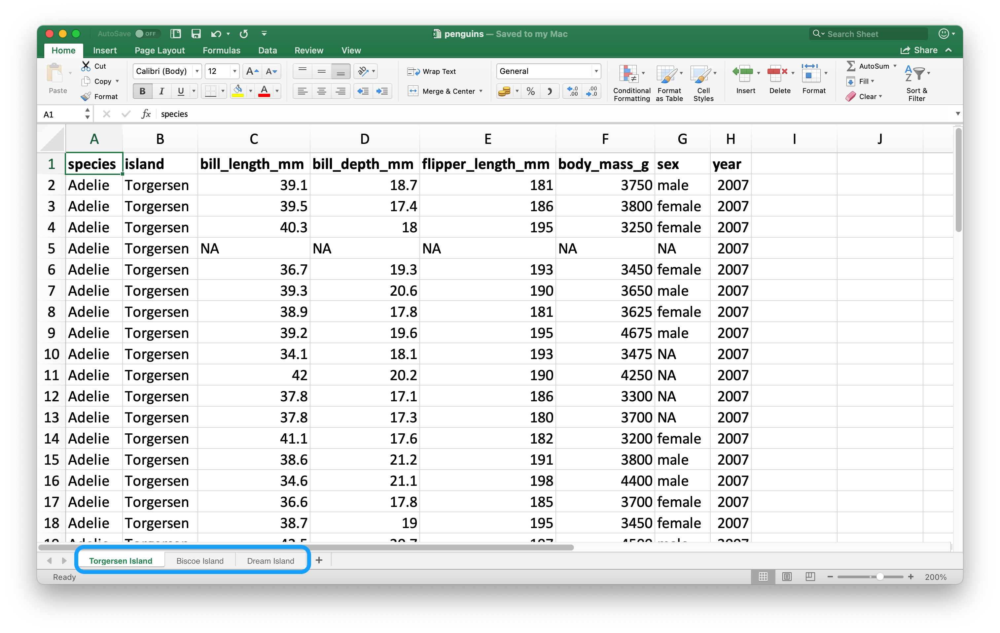

# 스프레드시트 {#import-spreadsheets}

## 들어가기

지금까지 우리는 플레인 텍스트 파일들, 즉 `.csv`, `.tsv` 파일들을 불러오는 것에 대해 배웠었다. 어떤 경우에는 스프레드시트에 있는 데이터를 분석해야 할 때가 있을 것이다. 
이번 장에서 엑셀 스프레드시트와 구글 시트 데이터와 작업하는 도구에 대해 소개할 것이다.
\@ref(data-import) 장과 \@ref(import-rectangular) 장에서 배운 것을 기반으로 이루어질 것이지만 스프레드시트 데이터로 작업할 때 생기는 추가적인 고려사항과 복잡성에 대해서도 논의할 것이다.

여러분, 혹은 여러분의 동료가 스프레드시트를 이용해서 데이터를 정리하고 있다면, Karl Broman 과 Kara Woo 이 쓴 논문, "Data Organization in Spreadsheets" 를 읽어보기를 강력히 추천한다: <https://doi.org/10.1080/00031305.2017.1375989>.
이 페이퍼에서 제공한 가장 좋은 실천방법을 따르면, 분석과 시각화를 위해 데이터를 스프레드시트에서 R 로 읽어올 때 훨씬 머리가 덜 아프게 만들어 줄 것이다.

## 엑셀

### 준비하기

In this chapter, you'll learn how to load data from Excel spreadsheets in R with the **readxl** package.
This package is non-core tidyverse, so you need to load it explicitly but it is installed automatically when you install the tidyverse package.


```r
library(readxl)
library(tidyverse)
#> ── Attaching packages ─────────────────────────────────────── tidyverse 1.3.0 ──
#> ✓ ggplot2 3.3.5     ✓ purrr   0.3.4
#> ✓ tibble  3.1.5     ✓ dplyr   1.0.7
#> ✓ tidyr   1.1.4     ✓ stringr 1.4.0
#> ✓ readr   1.4.0     ✓ forcats 0.5.1
#> ── Conflicts ────────────────────────────────────────── tidyverse_conflicts() ──
#> x dplyr::filter() masks stats::filter()
#> x dplyr::lag()    masks stats::lag()
```

**xlsx** 과 **XLConnect** 을 사용하여 엑셀 스프레드시트에서 데이터를 읽거나 쓸 수 있다.
그러나, 이 두 패키지는 컴퓨터에 Java 가 설치되어 있고, rJava 패키지가 있어야 한다.
설치할 때 문제가 생길 수 있으므로, 이 장에서 소개하는 다른 패키지들을 사용하길 추천한다.

### 시작하기

readxl 함수 대부분을 사용하여 엑셀 스프레드시트를 R 로 가져올 수 있다:

-   `read_xls()` reads Excel files with `xls` format.
-   `read_xlsx()` read Excel files with `xlsx` format.
-   `read_excel()` can read files with both `xls` and `xlsx` format. It guesses the file type based on the input.

이 함수들은 앞서 다른 종류의 파일을 읽는데 소개한 `read_csv()`, `read_table()` 과 같은 다른 함수과 유사한 문법을 갖는다.
이번 장 나머지 부분에서는 `read_excel()` 사용하는 법에 집중하도록 한다.

### 스프레드시트 읽어오기

R 로 읽어올 스프레드시트는 엑셀에서 Figure \@ref(fig:students-excel) 과 같이 생겼다.

<div class="figure" style="text-align: center">

<p class="caption">(\#fig:students-excel)Spreadsheet called students.xlsx in Excel.</p>
</div>

`read_excel()` 첫번째 인수는 읽을 파일의 경로이다.


```r
students <- read_excel("data/students.xlsx")
```

`read_excel()` 은 파일을 티블로 읽는다.


```r
students
#> # A tibble: 6 × 5
#>   `Student ID` `Full Name`      favourite.food     mealPlan            AGE  
#>          <dbl> <chr>            <chr>              <chr>               <chr>
#> 1            1 Sunil Huffmann   Strawberry yoghurt Lunch only          4    
#> 2            2 Barclay Lynn     French fries       Lunch only          5    
#> 3            3 Jayendra Lyne    N/A                Breakfast and lunch 7    
#> 4            4 Leon Rossini     Anchovies          Lunch only          <NA> 
#> 5            5 Chidiegwu Dunkel Pizza              Breakfast and lunch five 
#> 6            6 Güvenç Attila    Ice cream          Lunch only          6
```

데이터에는 학생 여섯이 있고 각 학생마다 변수 다섯개가 있다.
하지만 이 데이터셋에 관해 이야기 하고 싶은 것 몇 가지가 있다.

1.  The column names are all over the place.
    You can provide column names that follow a consistent format; we recommend `snake_case` using the `col_names` argument.

    
    ```r
    read_excel(
      "data/students.xlsx",
      col_names = c("student_id", "full_name", "favourite_food", "meal_plan", "age")
    )
    #> # A tibble: 7 × 5
    #>   student_id full_name        favourite_food     meal_plan           age  
    #>   <chr>      <chr>            <chr>              <chr>               <chr>
    #> 1 Student ID Full Name        favourite.food     mealPlan            AGE  
    #> 2 1          Sunil Huffmann   Strawberry yoghurt Lunch only          4    
    #> 3 2          Barclay Lynn     French fries       Lunch only          5    
    #> 4 3          Jayendra Lyne    N/A                Breakfast and lunch 7    
    #> 5 4          Leon Rossini     Anchovies          Lunch only          <NA> 
    #> 6 5          Chidiegwu Dunkel Pizza              Breakfast and lunch five 
    #> # … with 1 more row
    ```

    이렇게 해서 아직도 해결되지 않았다.
    우리가 원하는 변수 이름을 갖게 되었지만 이전 해더행이 데이터에서 첫번째 관측값으로 보여지고 있다.
    `skip` 인수를 써서 해당 행을 명시적으로 건너뛸 수 있다.

    
    ```r
    read_excel(
      "data/students.xlsx",
      col_names = c("student_id", "full_name", "favourite_food", "meal_plan", "age"),
      skip = 1
    )
    #> # A tibble: 6 × 5
    #>   student_id full_name        favourite_food     meal_plan           age  
    #>        <dbl> <chr>            <chr>              <chr>               <chr>
    #> 1          1 Sunil Huffmann   Strawberry yoghurt Lunch only          4    
    #> 2          2 Barclay Lynn     French fries       Lunch only          5    
    #> 3          3 Jayendra Lyne    N/A                Breakfast and lunch 7    
    #> 4          4 Leon Rossini     Anchovies          Lunch only          <NA> 
    #> 5          5 Chidiegwu Dunkel Pizza              Breakfast and lunch five 
    #> 6          6 Güvenç Attila    Ice cream          Lunch only          6
    ```

2.  `favourite_food` 열의 한 관측값은 `N/A` 인데 이는 "해당없음 (not available)" 을 의마한다. 하지만 현재 `NA` 로 인식되고 있지 않다 (이 `N/A` 와 리스트에서 네번째 학생의 나이 사이의 차이를 살펴보자).
    `na` 인수를 사용해서 어떤 문자열이 `NA` 로 인식되어야 하는지를 설정할 수 있다.
    기본값으로는 `""` (빈 문자열, 혹은 스프레드시트의 경우 빈 셀) 만 `NA` 로 인식된다.

    
    ```r
    read_excel(
      "data/students.xlsx",
      col_names = c("student_id", "full_name", "favourite_food", "meal_plan", "age"),
      skip = 1,
      na = c("", "N/A")
    )
    #> # A tibble: 6 × 5
    #>   student_id full_name        favourite_food     meal_plan           age  
    #>        <dbl> <chr>            <chr>              <chr>               <chr>
    #> 1          1 Sunil Huffmann   Strawberry yoghurt Lunch only          4    
    #> 2          2 Barclay Lynn     French fries       Lunch only          5    
    #> 3          3 Jayendra Lyne    <NA>               Breakfast and lunch 7    
    #> 4          4 Leon Rossini     Anchovies          Lunch only          <NA> 
    #> 5          5 Chidiegwu Dunkel Pizza              Breakfast and lunch five 
    #> 6          6 Güvenç Attila    Ice cream          Lunch only          6
    ```

3.  하나 남은 이슈는 `age` 가 문자열로 읽히고 있는데 실제는 수치형이 되어야 한다는 것이다.
    `read_csv()` 와 이웃함수들이 플랫 파일에서 데이터를 읽을 때와 같이 `col_types` 인수를 `read_excel()` 의 `col_types` 인수를 제공하고 읽고 있는 변수의 열 타잎을 명시해야한다. 
    문법은 약간 다르다.
    옵션은 `"skip"`, `"guess"`, `"logical"`, `"numeric"`, `"date"`, `"text"`, `"list"` 중 하나이다.

    
    ```r
    read_excel(
      "data/students.xlsx",
      col_names = c("student_id", "full_name", "favourite_food", "meal_plan", "age"),
      skip = 1,
      na = c("", "N/A"),
      col_types = c("numeric", "text", "text", "text", "numeric")
    )
    #> Warning in read_fun(path = enc2native(normalizePath(path)), sheet_i = sheet, :
    #> Expecting numeric in E6 / R6C5: got 'five'
    #> # A tibble: 6 × 5
    #>   student_id full_name        favourite_food     meal_plan             age
    #>        <dbl> <chr>            <chr>              <chr>               <dbl>
    #> 1          1 Sunil Huffmann   Strawberry yoghurt Lunch only              4
    #> 2          2 Barclay Lynn     French fries       Lunch only              5
    #> 3          3 Jayendra Lyne    <NA>               Breakfast and lunch     7
    #> 4          4 Leon Rossini     Anchovies          Lunch only             NA
    #> 5          5 Chidiegwu Dunkel Pizza              Breakfast and lunch    NA
    #> 6          6 Güvenç Attila    Ice cream          Lunch only              6
    ```

    하지만 이것도 원하는 결과를 만들지 못했다.
    `age` 가 수치형이라고 명시해서, 수치가 아닌 값을 가진 셀 (`five` 값을 가짐) 이 `NA` 로 변환되었다.
    이 경우, 나이를 `"text"` 로 읽은 후 데이터가 R 에 다 읽어진 후 작업을 해야 한다.

    
    ```r
    students <- read_excel(
      "data/students.xlsx",
      col_names = c("student_id", "full_name", "favourite_food", "meal_plan", "age"),
      skip = 1,
      na = c("", "N/A"),
      col_types = c("numeric", "text", "text", "text", "text")
    )
    
    students <- students %>%
      mutate(
        age = if_else(age == "five", "5", age),
        age = parse_number(age)
      )
    
    students
    #> # A tibble: 6 × 5
    #>   student_id full_name        favourite_food     meal_plan             age
    #>        <dbl> <chr>            <chr>              <chr>               <dbl>
    #> 1          1 Sunil Huffmann   Strawberry yoghurt Lunch only              4
    #> 2          2 Barclay Lynn     French fries       Lunch only              5
    #> 3          3 Jayendra Lyne    <NA>               Breakfast and lunch     7
    #> 4          4 Leon Rossini     Anchovies          Lunch only             NA
    #> 5          5 Chidiegwu Dunkel Pizza              Breakfast and lunch     5
    #> 6          6 Güvenç Attila    Ice cream          Lunch only              6
    ```

It took us multiple steps and trial-and-error to load the data in exactly the format we want, and this is not unexpected.
Data science is an iterative process.
There is no way to know exactly what the data will look like until you load it and take a look at it.
Well, there is one way, actually.
You can open the file in Excel and take a peek.
That might be tempting, but it's strongly not recommended.
<!--# TO DO: Provide reason why it's not recommended. --> Instead, you should not be afraid of doing what we did here: load the data, take a peek, make adjustments to your code, load it again, and repeat until you're happy with the result.

### 개별 시트 읽어오기

스프레드시트가 플랫 파일과 다른 중요한 특징은 다중 시트라는 개념이다.
Figure \@ref(fig:penguins-islands) 은 다중 시트가 있는 엑셀 스프레드시트를 보여준다.
**palmerpenguins** 패키지의 데이터이다.
각 시트에는 데이터가 수집된 개별 섬들의 펭귄에 관한 정보가 들어있다.

<div class="figure" style="text-align: center">

<p class="caption">(\#fig:penguins-islands)Spreadsheet called penguins.xlsx in Excel.</p>
</div>

`read_excel()` 의 `sheet` 인수를 이용하여 스프레드시트의 단일 시트를 읽을 수 있다.


```r
read_excel("data/penguins.xlsx", sheet = "Torgersen Island")
#> # A tibble: 52 × 8
#>   species island bill_length_mm bill_depth_mm flipper_length_… body_mass_g sex  
#>   <chr>   <chr>  <chr>          <chr>         <chr>            <chr>       <chr>
#> 1 Adelie  Torge… 39.1           18.7          181              3750        male 
#> 2 Adelie  Torge… 39.5           17.399999999… 186              3800        fema…
#> 3 Adelie  Torge… 40.2999999999… 18            195              3250        fema…
#> 4 Adelie  Torge… NA             NA            NA               NA          NA   
#> 5 Adelie  Torge… 36.7000000000… 19.3          193              3450        fema…
#> 6 Adelie  Torge… 39.2999999999… 20.6          190              3650        male 
#> # … with 46 more rows, and 1 more variable: year <dbl>
```

수치형 데이터를 포함한 것 같은 변수들이 문자열 `"NA"` 가 실제 `NA` 로 인식되지 않기 때문에 문자형으로 읽힌다.


```r
penguins_torgersen <- read_excel("data/penguins.xlsx", sheet = "Torgersen Island", na = "NA")

penguins_torgersen
#> # A tibble: 52 × 8
#>   species island bill_length_mm bill_depth_mm flipper_length_… body_mass_g sex  
#>   <chr>   <chr>           <dbl>         <dbl>            <dbl>       <dbl> <chr>
#> 1 Adelie  Torge…           39.1          18.7              181        3750 male 
#> 2 Adelie  Torge…           39.5          17.4              186        3800 fema…
#> 3 Adelie  Torge…           40.3          18                195        3250 fema…
#> 4 Adelie  Torge…           NA            NA                 NA          NA <NA> 
#> 5 Adelie  Torge…           36.7          19.3              193        3450 fema…
#> 6 Adelie  Torge…           39.3          20.6              190        3650 male 
#> # … with 46 more rows, and 1 more variable: year <dbl>
```

하지만 여기서 우리는 약간 반칙을 했다.
엑셀 스프레드시트 내부를 살펴봤는데, 이는 추천하는 워크플로우가 아니다.
대신, `excel_sheets()` 을 사용하여 엑셀 스프레드시트의 모든 시트 정보를 본 뒤 관심 있는 시트를 읽을 수 있다.


```r
excel_sheets("data/penguins.xlsx")
#> [1] "Torgersen Island" "Biscoe Island"    "Dream Island"
```

시트의 이름을 알면, 개별적으로 `read_excel()` 로 읽을 수 있다.


```r
penguins_biscoe <- read_excel("data/penguins.xlsx", sheet = "Biscoe Island", na = "NA")
penguins_dream  <- read_excel("data/penguins.xlsx", sheet = "Dream Island", na = "NA")
```

이 경우 총 펭귄 데이터셋이 스프레드 시트의 세 개의 시트에 퍼져있다.
각 시트는 열 개수가 서로 같지만 행 수는 다르다.


```r
dim(penguins_torgersen)
#> [1] 52  8
dim(penguins_biscoe)
#> [1] 168   8
dim(penguins_dream)
#> [1] 124   8
```

`bind_rows()`로 이 시트를 합칠 수 있다.


```r
penguins <- bind_rows(penguins_torgersen, penguins_biscoe, penguins_dream)
penguins
#> # A tibble: 344 × 8
#>   species island bill_length_mm bill_depth_mm flipper_length_… body_mass_g sex  
#>   <chr>   <chr>           <dbl>         <dbl>            <dbl>       <dbl> <chr>
#> 1 Adelie  Torge…           39.1          18.7              181        3750 male 
#> 2 Adelie  Torge…           39.5          17.4              186        3800 fema…
#> 3 Adelie  Torge…           40.3          18                195        3250 fema…
#> 4 Adelie  Torge…           NA            NA                 NA          NA <NA> 
#> 5 Adelie  Torge…           36.7          19.3              193        3450 fema…
#> 6 Adelie  Torge…           39.3          20.6              190        3650 male 
#> # … with 338 more rows, and 1 more variable: year <dbl>
```

\@ref(iteration) 장에서 우리는 we'll talk about ways of doing this sort of task without repetitive code <!--# Check to make sure that's the right place to present it -->.

### Reading part of a sheet

Since many use Excel spreadsheets for presentation as well as for data storage, it's quite common to find cell entries in a spreadsheet that are not part of the data you want to read into R.
Figure \@ref(fig:deaths-excel) shows such a spreadsheet: in the middle of the sheet is what looks like a data frame but there is extraneous text in cells above and below the data.

<div class="figure" style="text-align: center">

<p class="caption">(\#fig:deaths-excel)Spreadsheet called deaths.xlsx in Excel.</p>
</div>

This spreadsheet is one of the example spreadsheets provided in the readxl package.
You can use the `readxl_example()` function to locate the spreadsheet on your system in the directory where the package is installed.
This function returns the path to the spreadsheet, which you can use in `read_excel()` as usual.


```r
deaths_path <- readxl_example("deaths.xlsx")
deaths <- read_excel(deaths_path)
#> New names:
#> * `` -> ...2
#> * `` -> ...3
#> * `` -> ...4
#> * `` -> ...5
#> * `` -> ...6
deaths
#> # A tibble: 18 × 6
#>   `Lots of people`             ...2       ...3  ...4     ...5          ...6     
#>   <chr>                        <chr>      <chr> <chr>    <chr>         <chr>    
#> 1 simply cannot resist writing <NA>       <NA>  <NA>     <NA>          some not…
#> 2 at                           the        top   <NA>     of            their sp…
#> 3 or                           merging    <NA>  <NA>     <NA>          cells    
#> 4 Name                         Profession Age   Has kids Date of birth Date of …
#> 5 David Bowie                  musician   69    TRUE     17175         42379    
#> 6 Carrie Fisher                actor      60    TRUE     20749         42731    
#> # … with 12 more rows
```

맨 위 세 행과 맨 아래 네 행은 데이터프레임의 부분이 아니다.

맨 위 행들은 `skip` 으로 건너뛸 수 있다.
Note that we set `skip = 4` since the fourth row contains column names, not the data.


```r
read_excel(deaths_path, skip = 4)
#> # A tibble: 14 × 6
#>   Name          Profession Age   `Has kids` `Date of birth`     `Date of death`
#>   <chr>         <chr>      <chr> <chr>      <dttm>              <chr>          
#> 1 David Bowie   musician   69    TRUE       1947-01-08 00:00:00 42379          
#> 2 Carrie Fisher actor      60    TRUE       1956-10-21 00:00:00 42731          
#> 3 Chuck Berry   musician   90    TRUE       1926-10-18 00:00:00 42812          
#> 4 Bill Paxton   actor      61    TRUE       1955-05-17 00:00:00 42791          
#> 5 Prince        musician   57    TRUE       1958-06-07 00:00:00 42481          
#> 6 Alan Rickman  actor      69    FALSE      1946-02-21 00:00:00 42383          
#> # … with 8 more rows
```

We could also set `n_max` to omit the extraneous rows at the bottom.


```r
read_excel(deaths_path, skip = 4, n_max = 10)
#> # A tibble: 10 × 6
#>   Name       Profession   Age `Has kids` `Date of birth`     `Date of death`    
#>   <chr>      <chr>      <dbl> <lgl>      <dttm>              <dttm>             
#> 1 David Bow… musician      69 TRUE       1947-01-08 00:00:00 2016-01-10 00:00:00
#> 2 Carrie Fi… actor         60 TRUE       1956-10-21 00:00:00 2016-12-27 00:00:00
#> 3 Chuck Ber… musician      90 TRUE       1926-10-18 00:00:00 2017-03-18 00:00:00
#> 4 Bill Paxt… actor         61 TRUE       1955-05-17 00:00:00 2017-02-25 00:00:00
#> 5 Prince     musician      57 TRUE       1958-06-07 00:00:00 2016-04-21 00:00:00
#> 6 Alan Rick… actor         69 FALSE      1946-02-21 00:00:00 2016-01-14 00:00:00
#> # … with 4 more rows
```

Another approach is using cell ranges.
In Excel, the top left cell is `A1`.
As you move across columns to the right, the cell label moves down the alphabet, i.e.
`B1`, `C1`, etc.
And as you move down a column, the number in the cell label increases, i.e.
`A2`, `A3`, etc.

The data we want to read in starts in cell `A5` and ends in cell `F15`.
In spreadsheet notation, this is `A5:F15`.

-   Supply this information to the `range` argument:

    
    ```r
    read_excel(deaths_path, range = "A5:F15")
    ```

-   Specify rows:

    
    ```r
    read_excel(deaths_path, range = cell_rows(c(5, 15)))
    ```

-   Specify cells that mark the top-left and bottom-right corners of the data -- the top-left corner, `A5`, translates to `c(5, 1)` (5th row down, 1st column) and the bottom-right corner, `F15`, translates to `c(15, 6)`:

    
    ```r
    read_excel(deaths_path, range = cell_limits(c(5, 1), c(15, 6)))
    ```

If you have control over the sheet, an even better way is to create a "named range".
This is useful within Excel because named ranges help repeat formulas easier to create and they have some useful properties for creating dynamic charts and graphs as well.
Even if you're not working in Excel, named ranges can be useful for identifying which cells to read into R.
In the example above, the table we're reading in is named `Table1`, so we can read it in with the following.

**TO DO:** Add this once reading in named ranges are implemented in readxl.

### Data types

In CSV files, all values are strings.
This is not particularly true to the data, but it is simple: everything is a string.

The underlying data in Excel spreadsheets is more complex.
A cell can be one of five things:

-   A logical, like TRUE / FALSE

-   A number, like "10" or "10.5"

-   A date, which can also include time like "11/1/21" or "11/1/21 3:00 PM"

-   A string, like "ten"

-   A currency, which allows numeric values in a limited range and four decimal digits of fixed precision

When working with spreadsheet data, it's important to keep in mind that how the underlying data is stored can be very different than what you see in the cell.
For example, Excel has no notion of an integer.
All numbers are stored as floating points, but you can choose to display the data with a customizable number of decimal points.
Similarly, dates are actually stored as numbers, specifically the number of seconds since January 1, 1970.
You can customize how you display the date by applying formatting in Excel.
Confusingly, it's also possible to have something that looks like a number but is actually a string (e.g. type `'10` into a cell in Excel).

These differences between how the underlying data are stored vs. how they're displayed can cause surprises when the data are loaded into R.
By default readxl will guess the data type in a given column.
A recommended workflow is to let readxl guess the column types, confirm that you're happy with the guessed column types, and if not, go back and re-import specifying `col_types` as shown in Section \@ref(reading-spreadsheets).

Another challenge is when you have a column in your Excel spreadsheet that has a mix of these types, e.g. some cells are numeric, others text, others dates.
When importing the data into R readxl has to make some decisions.
In these cases you can set the type for this column to `"list"`, which will load the column as a list of length 1 vectors, where the type of each element of the vector is guessed.

### Data not in cell values

**tidyxl** is useful for importing non-tabular data from Excel files into R.
For example, tidyxl doesn't coerce a pivot table into a data frame.
See <https://nacnudus.github.io/spreadsheet-munging-strategies/> for more on strategies for working with non-tabular data from Excel.

### Writing to Excel

Let's create a small data frame that we can then write out.
Note that `item` is a factor and `quantity` is an integer.


```r
bake_sale <- tibble(
  item     = factor(c("brownie", "cupcake", "cookie")),
  quantity = c(10, 5, 8)
)

bake_sale
#> # A tibble: 3 × 2
#>   item    quantity
#>   <fct>      <dbl>
#> 1 brownie       10
#> 2 cupcake        5
#> 3 cookie         8
```

You can write data back to disk as an Excel file using the `write_xlsx()` from the **writexl** package.


```r
library(writexl)
write_xlsx(bake_sale, path = "data/bake-sale.xlsx")
```

Figure \@ref(fig:bake-sale-excel) shows what the data looks like in Excel.
Note that column names are included and bolded.
These can be turned off by setting `col_names` and `format_headers` arguments to `FALSE`.

<div class="figure" style="text-align: center">

<p class="caption">(\#fig:bake-sale-excel)Spreadsheet called bake_sale.xlsx in Excel.</p>
</div>

Just like reading from a CSV, information on data type is lost when we read the data back in.
This makes Excel files unreliable for caching interim results as well.
For alternatives, see Section \@ref(writing-to-a-file).


```r
read_excel("data/bake-sale.xlsx")
#> # A tibble: 3 × 2
#>   item    quantity
#>   <chr>      <dbl>
#> 1 brownie       10
#> 2 cupcake        5
#> 3 cookie         8
```

### Formatted output

The readxl package is a light-weight solution for writing a simple Excel spreadsheet, but if you're interested in additional features like writing to sheets within a spreadsheet and styling, you will want to use the **openxlsx** package.
Note that this package is not part of the tidyverse so the functions and workflows may feel unfamiliar.
For example, function names are camelCase, multiple functions can't be composed in pipelines, and arguments are in a different order than they tend to be in the tidyverse.
However, this is ok.
As your R learning and usage expands outside of this book you will encounter lots of different styles used in various R packages that you might need to use to accomplish specific goals in R.
A good way of familiarizing yourself with the coding style used in a new package is to run the examples provided in function documentation to get a feel for the syntax and the output formats as well as reading any vignettes that might come with the package.

Below we show how to write a spreadsheet with three sheets, one for each species of penguins in the `penguins` data frame.


```r
library(openxlsx)
library(palmerpenguins)

# Create a workbook (spreadsheet)
penguins_species <- createWorkbook()

# Add three sheets to the spreadsheet
addWorksheet(penguins_species, sheetName = "Adelie")
addWorksheet(penguins_species, sheetName = "Gentoo")
addWorksheet(penguins_species, sheetName = "Chinstrap")

# Write data to each sheet
writeDataTable(
  penguins_species,
  sheet = "Adelie",
  x = penguins %>% filter(species == "Adelie")
)
writeDataTable(
  penguins_species,
  sheet = "Gentoo",
  x = penguins %>% filter(species == "Gentoo")
)
writeDataTable(
  penguins_species,
  sheet = "Chinstrap",
  x = penguins %>% filter(species == "Chinstrap")
)
```

This creates a workbook object:


```r
penguins_species
#> A Workbook object.
#>  
#> Worksheets:
#>  Sheet 1: "Adelie"
#>  
#> 
#>  Sheet 2: "Gentoo"
#>  
#> 
#>  Sheet 3: "Chinstrap"
#>  
#> 
#>  
#>  Worksheet write order: 1, 2, 3
#>  Active Sheet 1: "Adelie" 
#> 	Position: 1
```

And we can write this to this with `saveWorkbook()`.


```r
saveWorkbook(penguins_species, "data/penguins-species.xlsx")
```

The resulting spreadsheet is shown in Figure \@ref(fig:penguins-species).
By default, openxlsx formats the data as an Excel table.

<div class="figure" style="text-align: center">

<p class="caption">(\#fig:penguins-species)Spreadsheet called penguins.xlsx in Excel.</p>
</div>

See <https://ycphs.github.io/openxlsx/articles/Formatting.html> for an extensive discussion on further formatting functionality for data written from R to Excel with openxlsx.

### Exercises

1.  Recreate the `bake_sale` data frame, write it out to an Excel file using the `write.xlsx()` function from the openxlsx package.
2.  What happens if you try to read in a file with `.xlsx` extension with `read_xls()`?

