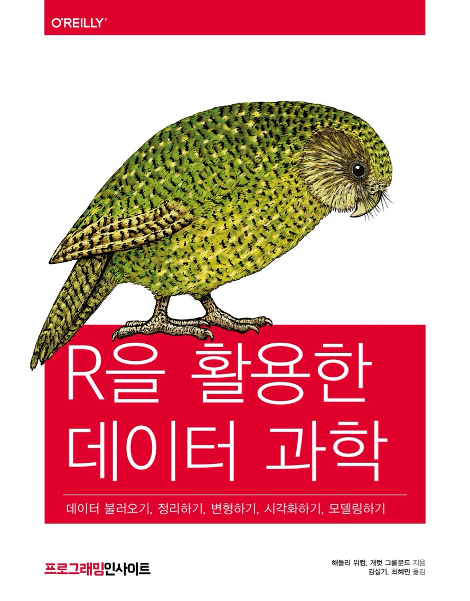

# 환영합니다 {-} 

 이 곳은 해들리 위컴과 개럿 그롤문드의 책 [**"R for Data Science"**](http://amzn.to/2aHLAQ1) 의 번역본인 **"R 을 활용한 데이터과학 (인사이트)"** (번역: [김설기](https://github.com/sulgik), 최혜민)의 웹북입니다. 책의 일부를 담고 있으며 꾸준히 업데이트되고 있습니다.

책은 [알라딘](http://aladin.kr/p/K2RFR), [yes24](http://www.yes24.com/24/Goods/67856488?Acode=101) 등에서 구입할 수 있습니다.

본 웹북은 [RMarkdown](https://rmarkdown.rstudio.com) 과 [bookdown](https://bookdown.org) 으로 작성되었습니다. 영문 웹북은 <https://r4ds.had.co.nz> 입니다.
연습문제 해답은 [여기](https://jrnold.github.io/r4ds-exercise-solutions/)에서 볼 수 있습니다.
