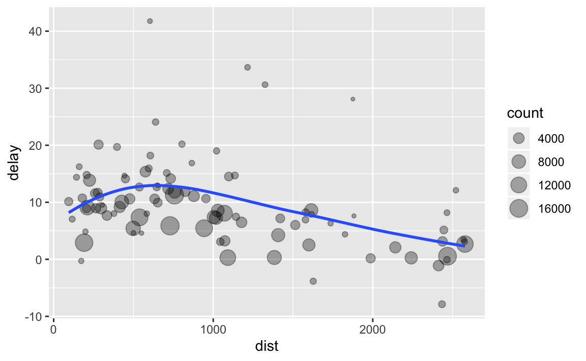
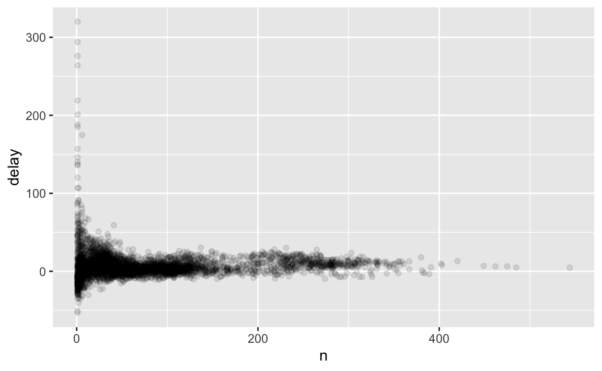
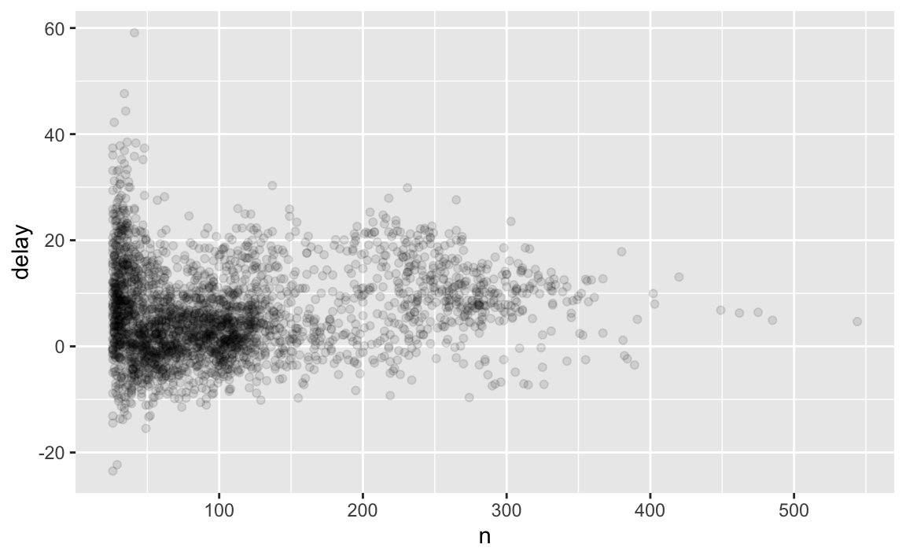

# 데이터 변형 {#transform}

## 들어가기

시각화는 직관을 얻을 수 있는 중요한 도구이다. 하지만 데이터가 정확히 필요한 형태를 취하는 경우는 거의 없다. 
데이터를 좀 더 쉽게 사용할 수 있도록 새로운 변수나 요약값을 만들어야 할 수도 있고, 아니면 변수 이름을 변경하거나 관측값들을 재정렬해야 되는 경우가 종종 있다. 
이 장에서 이 모든 것을 배울 것인데, dplyr 패키지와 2013년 뉴욕시 출발 항공편에 대한 새로운 데이터셋을 이용하여 데이터 변형 방법을 배울 것이다.

### 준비하기

이 장에서 우리는 tidyverse의 또 다른 핵심 구성원인 dplyr 패키지를 사용하는 법에 집중할 것이다. nycflights13 패키지의 데이터를 이용하여 핵심 아이디어를
배우고, ggplot2를 이용하여 데이터를 이해해볼 것이다.


```r
library(nycflights13)
library(tidyverse)
```

tidyverse를 로드할 때 출력되는 충돌 메시지를 조심히 살펴보라. dplyr이 베이스 R 함수 몇 개를 덮어쓴다고 알려준다. 
dplyr를 로딩한 후 이 함수들의 베이스 버전을 사용하고 싶다면 `stats::filter()` 혹은 `stats::lag()` 와 같이 전체 이름을
사용해야 한다.

### nycflights13

dplyr의 기본 데이터 작업(manipulation) 동사를 탐색하기 위해  `nycflights13::flights` 를 사용할 것이다. 
이 데이터프레임에는 뉴욕시에서 2013년에 출발한 336,776개의 모든 항공편이 포함되어 있다. 
데이터의 출처는 US [Bureau of Transportation Statistics](http://www.transtats.bts.gov/DatabaseInfo.asp?DB_ID=120&Link=0)이며 `?flights`에 문서화되어 있다.


```r
flights
#> # A tibble: 336,776 x 19
#>    year month   day dep_time sched_dep_time dep_delay arr_time
#>   <int> <int> <int>    <int>          <int>     <dbl>    <int>
#> 1  2013     1     1      517            515         2      830
#> 2  2013     1     1      533            529         4      850
#> 3  2013     1     1      542            540         2      923
#> 4  2013     1     1      544            545        -1     1004
#> 5  2013     1     1      554            600        -6      812
#> 6  2013     1     1      554            558        -4      740
#> # ... with 3.368e+05 more rows, and 12 more variables:
#> #   sched_arr_time <int>, arr_delay <dbl>, carrier <chr>, flight <int>,
#> #   tailnum <chr>, origin <chr>, dest <chr>, air_time <dbl>,
#> #   distance <dbl>, hour <dbl>, minute <dbl>, time_hour <dttm>
```

이 데이터프레임은 이전에 사용했던 데이터프레임과 조금 다르게 출력되는 것을 알아차렸을 것이다. 
즉, 처음 몇 행과 화면에 들어가는 열만 표시되었다. 
(데이터셋 전체를 보려면 `View(flights)`를 실행하여 RStudio 뷰어에서 데이터셋을 열 수 있다.) 
**티블(tibble)**이라서 다르게 출력되었다. 티블은 데이터프레임이지만 tidyverse에서 더 잘 작동하도록 약간 조정되었다. 
지금은 차이를 알 필요가 없고 [wrangle](#wrangle-intro) 에서 티블에 대해 더 깊이 살펴볼 것이다.

열 이름 아래의 세 글자(또는 네 글자) 줄임말 행을 봤을 것이다. 이는 각 변수의 유형을 설명한다.

* `int` 는 정수를 의미한다.

* `dbl` 은 더블형, 또는 실수를 의미한다.

* `chr` 은 문자형 벡터, 혹은 문자열을 의미한다.

* `dttm` 은 데이트-타임형(날짜 + 시간)을 의미한다.

이 데이터셋에서 사용되지 않은 세 가지 일반적인 변수 유형이 있는데 이 책 뒤에서 살펴볼 것이다.

* `lgl` 은 `TRUE` 혹은 `FALSE` 만 포함하는 벡터인 논리형을 의미한다.

* `fctr` 은 팩터형을 의미하는데, R은 이를 이용하여 가능한 값이 미리 정해진 범주형 변수를 나타낸다.

* `date` 는 데이트형을 의미한다.


### dplyr basics

이 장에서 대부분의 데이터 작업 문제를 풀 수 있는 다섯 개의 핵심 dplyr 함수들
을 배울 것이다.

* 값을 기준으로 선택하라 (`filter()`).
* 행을 재정렬하라 (`arrange()`).
* 이름으로 변수를 선택하라 (`select()`).
* 기존 변수들의 함수로 새로운 변수를 생성하라 (`mutate()`).
* 많은 값을 하나의 요약값으로 합쳐라 (`summarize()`).

이것들은 모두 `group_by()` 와 함께 사용할 수 있는데, 
이는 전체 데이터셋에 동작하지 않고 그룹마다 동작하도록 각 함수의 범위를 변경한다. 
이 여섯 함수가 데이터 작업 언어에서 동사가 된다.

모든 동사는 비슷하게 작동한다.

1. 첫 인수는 데이터프레임이다.

1. 그 이후의 인수들은 (따옴표가 없는) 변수 이름을 사용하여 데이터프레임에
무엇을 할지를 설명한다.

1. 결과는 새로운 데이터프레임이다.

이 속성들을 함께 이용하면 여러 단순한 단계를 쉽게 연결하여 복잡한 결과를
얻을 수 있다. 이 동사들이 어떻게 작동하는지 좀 더 살펴보자.

## Filter rows with `filter()`

`filter()` 를 이용하면 값을 기준으로 데이터를 서브셋할 수 있다. 
첫 번째 인수는 데이터프레임 이름이다. 두 번째 이후의 인수들은 데이터프레임을 필터링하는 표현식들이다. 예를 들어 1월 1일 항공편 모두를 다음과 같이
선택할 수 있다.


```r
filter(flights, month == 1, day == 1)
#> # A tibble: 842 x 19
#>    year month   day dep_time sched_dep_time dep_delay arr_time
#>   <int> <int> <int>    <int>          <int>     <dbl>    <int>
#> 1  2013     1     1      517            515         2      830
#> 2  2013     1     1      533            529         4      850
#> 3  2013     1     1      542            540         2      923
#> 4  2013     1     1      544            545        -1     1004
#> 5  2013     1     1      554            600        -6      812
#> 6  2013     1     1      554            558        -4      740
#> # ... with 836 more rows, and 12 more variables: sched_arr_time <int>,
#> #   arr_delay <dbl>, carrier <chr>, flight <int>, tailnum <chr>,
#> #   origin <chr>, dest <chr>, air_time <dbl>, distance <dbl>, hour <dbl>,
#> #   minute <dbl>, time_hour <dttm>
```

해당 코드 라인을 실행하면 dplyr은 필터링 연산을 실행하고 새로운 데이터프레임을 반환한다. 
dplyr 함수들은 입력을 절대 수정하지 않기 때문에, 결과를 저장하려면 할당 연산자 `<-` 를 사용해야 한다.


```r
jan1 <- filter(flights, month == 1, day == 1)
```

R은 결과를 출력하거나 변수에 저장한다. 둘 다 수행되게 하려면 할당문을 괄호로 묶으면 된다.


```r
(dec25 <- filter(flights, month == 12, day == 25))
#> # A tibble: 719 x 19
#>    year month   day dep_time sched_dep_time dep_delay arr_time
#>   <int> <int> <int>    <int>          <int>     <dbl>    <int>
#> 1  2013    12    25      456            500        -4      649
#> 2  2013    12    25      524            515         9      805
#> 3  2013    12    25      542            540         2      832
#> 4  2013    12    25      546            550        -4     1022
#> 5  2013    12    25      556            600        -4      730
#> 6  2013    12    25      557            600        -3      743
#> # ... with 713 more rows, and 12 more variables: sched_arr_time <int>,
#> #   arr_delay <dbl>, carrier <chr>, flight <int>, tailnum <chr>,
#> #   origin <chr>, dest <chr>, air_time <dbl>, distance <dbl>, hour <dbl>,
#> #   minute <dbl>, time_hour <dttm>
```

### Comparisons

필터링을 효과적으로 사용하려면 비교 연산자를 사용하여 원하는 관측값을 선택하는 방법을 알아야 한다. 
R에는 표준연산자군이 있다. `>`, `>=`, `<`, `<=`, `!=` (같지 않음), `==` (같음).
R을 배우기 시작할 때, 가장 범하기 쉬운 실수는, 같음을 테스트할 때 `==` 대신 `=` 를 사용하는 것이다. 
이런 실수를 하면 오류가 발생하면서 해당 내용을 알려준다.


```r
filter(flights, month = 1)
#> Error: `month` (`month = 1`) must not be named, do you need `==`?
```

`==` 를 사용할 때 자주 발생하는 다른 문제는 부동소수점 숫자이다. 다음 결과들에 놀랄 것이다.


```r
sqrt(2) ^ 2 == 2
#> [1] FALSE
1 / 49 * 49 == 1
#> [1] FALSE
```

컴퓨터는 유한 정밀도 산술을 사용하므로(무한대 수를 저장할 수 없는 건 당연하다) 눈 앞에 보이는 숫자는 근사값이라는 것을 기억하라. 
`==` 대신, `near()` 를 사용하라.


```r
near(sqrt(2) ^ 2,  2)
#> [1] TRUE
near(1 / 49 * 49, 1)
#> [1] TRUE
```

### Logical operators

`filter()` 의 인수들은 ‘and’로 결합된다. 즉, 모든 표현식이 참이어야 행이 출력에
포함된다. 다른 유형의 조합을 만들려면 직접 불(Boolean) 연산자를 사용해야
한다. `&` 는 ‘and’, `|` 는 ‘or’, `!` 는 ‘not’이다. 다음의 그림은 불 연산자 전체 집합을 보여준다.

<div class="figure" style="text-align: center">

<p class="caption">(\#fig:bool-ops)Complete set of boolean operations. `x` is the left-hand circle, `y` is the right-hand circle, and the shaded region show which parts each operator selects.</p>
</div>

다음 코드는 11월이나 12월에 출발한 항공편 모두를 찾는다.


```r
filter(flights, month == 11 | month == 12)
```

연산 순서는 영어에서의 순서와 다르다. `filter(flights, month == 11 | 12)` 로 쓰면 
직역으로 ‘finds all flights that departed in November or December’로 번역되겠지만 이렇게 쓰면 안 된다. 
대신 `11 | 12` (이 표현식은 `TRUE`가 됨)와 같은 달을 모두 찾는다. 
수치형 문맥에서 `TRUE` 는 1 이 되므로 이는 11월이나 12월이 아닌 1월의 모든 항공편을 찾는다. 꽤 혼란스럽다!

이 문제에 유용한 팁은 `x %in% y`이다. 이는 `x`가 `y`에 있는 값 중 하나인 행을 모두 선택한다.


```r
nov_dec <- filter(flights, month %in% c(11, 12))
```

드 모르간 법칙을 기억에서 불러내어 복잡한 서브셋 동작을
단순화할 수도 있다. `!(x & y)` 는 `!x | !y` 와 같고 `!(x | y)` 는 `!x & !y` 와 같다. 
예를 들어 (출발 혹은 도착에서) 두 시간 이상 지연되지 않은 항공편을 모두 찾고 싶다면 다음의 두 필터 중 하나를 사용해도 된다.


```r
filter(flights, !(arr_delay > 120 | dep_delay > 120))
filter(flights, arr_delay <= 120, dep_delay <= 120)
```

R에는 `&` 와 `|` 외에도 `&&` 와 `||` 도 있다. 여기서는 사용하지 않는다! [conditional execution]에서 이들을 사용해야 할 때 배울 것이다.

`filter()` 안의 표현식이 복잡하고 다중으로 되기 시작하면, 항상 이들을 명시적 변수들로 만드는 것을 고려하라. 
이렇게 하면 작업을 확인하기 훨씬 쉬워진다. 새 변수를 만드는 법은 곧 배울 것이다.

### 결측값

R에서 비교를 까다롭게 만드는 중요한 특징은 결측값, 즉 `NA` (‘not available, 이용불가’)이다. 
`NA` 는 모르는 값을 나타내므로 결측값은 ‘파급된다(contagious)’. 즉,
모르는 값이 연관된 연산의 결과도 대부분 모르는 값이 된다.


```r
NA > 5
#> [1] NA
10 == NA
#> [1] NA
NA + 10
#> [1] NA
NA / 2
#> [1] NA
```

가장 헷갈리는 결과는 이것이다.


```r
NA == NA
#> [1] NA
```

문맥이 더 있으면 왜 이것이 사실인지 이해하기 쉽다.


```r
# 메리의 나이를 x 라고 하자. 우리는 그녀가 몇 살인지 모른다.
x <- NA

# 존의 나이를 y 라고 하자. 우리는 그가 몇 살인지 모른다. 
y <- NA

# 존과 메리는 같은 나이인가?
x == y
#> [1] NA
# 우린 모른다!
```

값이 결측인지를 확인하고 싶으면 `is.na()` 를 사용하라.


```r
is.na(x)
#> [1] TRUE
```

`filter()` 는 조건이 `TRUE` 인 열만 포함한다. `FALSE` 와 `NA` 값들은 제외한다. 결측값들을 남기려면 명시적으로 요청하라.


```r
df <- tibble(x = c(1, NA, 3))
filter(df, x > 1)
#> # A tibble: 1 x 1
#>       x
#>   <dbl>
#> 1     3
filter(df, is.na(x) | x > 1)
#> # A tibble: 2 x 1
#>       x
#>   <dbl>
#> 1    NA
#> 2     3
```

### 연습문제

1.  다음 조건을 만족하는 항공편을 모두 찾아라.

    1. 2시간 이상 도착 지연
    1. 휴스턴(IAH 혹은 HOU)으로 운항
    1. 유나이티드항공(United), 아메리칸항공(American), 델타항공(Delta)이 운항
    1. 여름 (7, 8, 9월)에 출발
    1. 2시간 이상 지연 도착했지만, 지연 출발하지는 않음
    1. 최소 한 시간 이상 지연됐지만 운항 중 30분 이상 단축
    1. 자정과 6am (포함) 사이에 출발

1.  다른 유용한 dplyr 필터링 도우미로 `between()` 이 있다. 어떤 일을 하는가? 이
도우미로 이전 문제들을 해결하는 데 사용한 코드들을 단순하게 할 수 있는가?

1. `dep_time` 이 결측인 항공편은 몇 편인가? 어떤 다른 변수들이 결측인가? 이 열들이 나타내는 것은 무엇이겠는가?

1. `NA ^ 0` 은 왜 결측이 아닌가? `NA | TRUE` 는 왜 결측이 아닌가? `FALSE & NA` 는 왜
결측이 아닌가? 일반 규칙을 발견할 수 있겠는가? (`NA * 0` 은 까다로운 반례이다!)


## Arrange rows with `arrange()`

`arrange()` 는 행을 선택하는 것 대신, 순서를 바꾼다는 것만 제외하고는 `filter()`
와 유사하게 작동한다. 데이터프레임과 정렬기준으로 지정할 열 이름 집합(혹은
복잡한 표현식)을 입력으로 한다. 하나 이상의 열 이름을 제공하면 각 열은 이전
열의 동점값(tie) 상황을 해결하는 데 사용된다.


```r
arrange(flights, year, month, day)
#> # A tibble: 336,776 x 19
#>    year month   day dep_time sched_dep_time dep_delay arr_time
#>   <int> <int> <int>    <int>          <int>     <dbl>    <int>
#> 1  2013     1     1      517            515         2      830
#> 2  2013     1     1      533            529         4      850
#> 3  2013     1     1      542            540         2      923
#> 4  2013     1     1      544            545        -1     1004
#> 5  2013     1     1      554            600        -6      812
#> 6  2013     1     1      554            558        -4      740
#> # ... with 3.368e+05 more rows, and 12 more variables:
#> #   sched_arr_time <int>, arr_delay <dbl>, carrier <chr>, flight <int>,
#> #   tailnum <chr>, origin <chr>, dest <chr>, air_time <dbl>,
#> #   distance <dbl>, hour <dbl>, minute <dbl>, time_hour <dttm>
```

`desc()` 를 사용하여 내림차순으로 열을 재정렬하라.


```r
arrange(flights, desc(dep_delay))
#> # A tibble: 336,776 x 19
#>    year month   day dep_time sched_dep_time dep_delay arr_time
#>   <int> <int> <int>    <int>          <int>     <dbl>    <int>
#> 1  2013     1     9      641            900      1301     1242
#> 2  2013     6    15     1432           1935      1137     1607
#> 3  2013     1    10     1121           1635      1126     1239
#> 4  2013     9    20     1139           1845      1014     1457
#> 5  2013     7    22      845           1600      1005     1044
#> 6  2013     4    10     1100           1900       960     1342
#> # ... with 3.368e+05 more rows, and 12 more variables:
#> #   sched_arr_time <int>, arr_delay <dbl>, carrier <chr>, flight <int>,
#> #   tailnum <chr>, origin <chr>, dest <chr>, air_time <dbl>,
#> #   distance <dbl>, hour <dbl>, minute <dbl>, time_hour <dttm>
```

결측값은 항상 마지막에 정렬된다.


```r
df <- tibble(x = c(5, 2, NA))
arrange(df, x)
#> # A tibble: 3 x 1
#>       x
#>   <dbl>
#> 1     2
#> 2     5
#> 3    NA
arrange(df, desc(x))
#> # A tibble: 3 x 1
#>       x
#>   <dbl>
#> 1     5
#> 2     2
#> 3    NA
```

### 연습문제

1.  `arrange()` 를 사용하여 모든 결측값을 앞에 오도록 정렬하라 (힌트: `is.na()` 를
사용하라).

1. `flights` 를 정렬하여 가장 지연된 항공편을 찾아라. 가장 일찍 출발한 항공편을 찾아라.

1. `flights` 를 정렬하여 가장 빠른 항공편을 찾아라.

1. 어떤 항공편이 가장 멀리 운항했는가? 가장 짧게 운항한 항공편은?

## Select columns with `select()` {#select}

변수가 수백, 수천 개인 데이터셋을 심심치 않게 만날 것이다. 
이 경우 첫 과제는 실제로 관심 있는 변수들로 좁히는 것이다. `select()` 와 변수 이름에 
기반한 연산들을 이용하면 유용한 서브셋으로 신속하게 줌인(zoom in)해 볼 수 있다.

변수가 19개밖에 없는 항공편 데이터에서는 `select()` 가 엄청나게 유용하지는
않지만 일반적인 개념을 볼 수는 있다.

It's not uncommon to get datasets with hundreds or even thousands of variables. In this case, the first challenge is often narrowing in on the variables you're actually interested in. `select()` allows you to rapidly zoom in on a useful subset using operations based on the names of the variables.

`select()` is not terribly useful with the flights data because we only have 19 variables, but you can still get the general idea:


```r
# Select columns by name
select(flights, year, month, day)
#> # A tibble: 336,776 x 3
#>    year month   day
#>   <int> <int> <int>
#> 1  2013     1     1
#> 2  2013     1     1
#> 3  2013     1     1
#> 4  2013     1     1
#> 5  2013     1     1
#> 6  2013     1     1
#> # ... with 3.368e+05 more rows
# Select all columns between year and day (inclusive)
select(flights, year:day)
#> # A tibble: 336,776 x 3
#>    year month   day
#>   <int> <int> <int>
#> 1  2013     1     1
#> 2  2013     1     1
#> 3  2013     1     1
#> 4  2013     1     1
#> 5  2013     1     1
#> 6  2013     1     1
#> # ... with 3.368e+05 more rows
# Select all columns except those from year to day (inclusive)
select(flights, -(year:day))
#> # A tibble: 336,776 x 16
#>   dep_time sched_dep_time dep_delay arr_time sched_arr_time arr_delay
#>      <int>          <int>     <dbl>    <int>          <int>     <dbl>
#> 1      517            515         2      830            819        11
#> 2      533            529         4      850            830        20
#> 3      542            540         2      923            850        33
#> 4      544            545        -1     1004           1022       -18
#> 5      554            600        -6      812            837       -25
#> 6      554            558        -4      740            728        12
#> # ... with 3.368e+05 more rows, and 10 more variables: carrier <chr>,
#> #   flight <int>, tailnum <chr>, origin <chr>, dest <chr>, air_time <dbl>,
#> #   distance <dbl>, hour <dbl>, minute <dbl>, time_hour <dttm>
```

There are a number of helper functions you can use within `select()`:

* `starts_with("abc")`: matches names that begin with "abc".

* `ends_with("xyz")`: matches names that end with "xyz".

* `contains("ijk")`: matches names that contain "ijk".

* `matches("(.)\\1")`: selects variables that match a regular expression.
   This one matches any variables that contain repeated characters. You'll 
   learn more about regular expressions in [strings].
   
*  `num_range("x", 1:3)`: matches `x1`, `x2` and `x3`.
   
See `?select` for more details.

`select()` can be used to rename variables, but it's rarely useful because it drops all of the variables not explicitly mentioned. Instead, use `rename()`, which is a variant of `select()` that keeps all the variables that aren't explicitly mentioned:


```r
rename(flights, tail_num = tailnum)
#> # A tibble: 336,776 x 19
#>    year month   day dep_time sched_dep_time dep_delay arr_time
#>   <int> <int> <int>    <int>          <int>     <dbl>    <int>
#> 1  2013     1     1      517            515         2      830
#> 2  2013     1     1      533            529         4      850
#> 3  2013     1     1      542            540         2      923
#> 4  2013     1     1      544            545        -1     1004
#> 5  2013     1     1      554            600        -6      812
#> 6  2013     1     1      554            558        -4      740
#> # ... with 3.368e+05 more rows, and 12 more variables:
#> #   sched_arr_time <int>, arr_delay <dbl>, carrier <chr>, flight <int>,
#> #   tail_num <chr>, origin <chr>, dest <chr>, air_time <dbl>,
#> #   distance <dbl>, hour <dbl>, minute <dbl>, time_hour <dttm>
```

Another option is to use `select()` in conjunction with the `everything()` helper. This is useful if you have a handful of variables you'd like to move to the start of the data frame.


```r
select(flights, time_hour, air_time, everything())
#> # A tibble: 336,776 x 19
#>   time_hour           air_time  year month   day dep_time sched_dep_time
#>   <dttm>                 <dbl> <int> <int> <int>    <int>          <int>
#> 1 2013-01-01 05:00:00      227  2013     1     1      517            515
#> 2 2013-01-01 05:00:00      227  2013     1     1      533            529
#> 3 2013-01-01 05:00:00      160  2013     1     1      542            540
#> 4 2013-01-01 05:00:00      183  2013     1     1      544            545
#> 5 2013-01-01 06:00:00      116  2013     1     1      554            600
#> 6 2013-01-01 05:00:00      150  2013     1     1      554            558
#> # ... with 3.368e+05 more rows, and 12 more variables: dep_delay <dbl>,
#> #   arr_time <int>, sched_arr_time <int>, arr_delay <dbl>, carrier <chr>,
#> #   flight <int>, tailnum <chr>, origin <chr>, dest <chr>, distance <dbl>,
#> #   hour <dbl>, minute <dbl>
```

### Exercises

1.  Brainstorm as many ways as possible to select `dep_time`, `dep_delay`,
    `arr_time`, and `arr_delay` from `flights`.
    
1.  What happens if you include the name of a variable multiple times in
    a `select()` call?
  
1.  What does the `one_of()` function do? Why might it be helpful in conjunction
    with this vector?
    
    
    ```r
    vars <- c("year", "month", "day", "dep_delay", "arr_delay")
    ```
    
1.  Does the result of running the following code surprise you?  How do the
    select helpers deal with case by default? How can you change that default?

    
    ```r
    select(flights, contains("TIME"))
    ```

## Add new variables with `mutate()`

Besides selecting sets of existing columns, it's often useful to add new columns that are functions of existing columns. That's the job of `mutate()`. 

`mutate()` always adds new columns at the end of your dataset so we'll start by creating a narrower dataset so we can see the new variables. Remember that when you're in RStudio, the easiest way to see all the columns is `View()`.


```r
flights_sml <- select(flights, 
  year:day, 
  ends_with("delay"), 
  distance, 
  air_time
)
mutate(flights_sml,
  gain = dep_delay - arr_delay,
  speed = distance / air_time * 60
)
#> # A tibble: 336,776 x 9
#>    year month   day dep_delay arr_delay distance air_time  gain speed
#>   <int> <int> <int>     <dbl>     <dbl>    <dbl>    <dbl> <dbl> <dbl>
#> 1  2013     1     1         2        11     1400      227    -9  370.
#> 2  2013     1     1         4        20     1416      227   -16  374.
#> 3  2013     1     1         2        33     1089      160   -31  408.
#> 4  2013     1     1        -1       -18     1576      183    17  517.
#> 5  2013     1     1        -6       -25      762      116    19  394.
#> 6  2013     1     1        -4        12      719      150   -16  288.
#> # ... with 3.368e+05 more rows
```

Note that you can refer to columns that you've just created:


```r
mutate(flights_sml,
  gain = dep_delay - arr_delay,
  hours = air_time / 60,
  gain_per_hour = gain / hours
)
#> # A tibble: 336,776 x 10
#>    year month   day dep_delay arr_delay distance air_time  gain hours
#>   <int> <int> <int>     <dbl>     <dbl>    <dbl>    <dbl> <dbl> <dbl>
#> 1  2013     1     1         2        11     1400      227    -9  3.78
#> 2  2013     1     1         4        20     1416      227   -16  3.78
#> 3  2013     1     1         2        33     1089      160   -31  2.67
#> 4  2013     1     1        -1       -18     1576      183    17  3.05
#> 5  2013     1     1        -6       -25      762      116    19  1.93
#> 6  2013     1     1        -4        12      719      150   -16  2.5 
#> # ... with 3.368e+05 more rows, and 1 more variable: gain_per_hour <dbl>
```

If you only want to keep the new variables, use `transmute()`:


```r
transmute(flights,
  gain = dep_delay - arr_delay,
  hours = air_time / 60,
  gain_per_hour = gain / hours
)
#> # A tibble: 336,776 x 3
#>    gain hours gain_per_hour
#>   <dbl> <dbl>         <dbl>
#> 1    -9  3.78         -2.38
#> 2   -16  3.78         -4.23
#> 3   -31  2.67        -11.6 
#> 4    17  3.05          5.57
#> 5    19  1.93          9.83
#> 6   -16  2.5          -6.4 
#> # ... with 3.368e+05 more rows
```

### Useful creation functions {#mutate-funs}

There are many functions for creating new variables that you can use with `mutate()`. The key property is that the function must be vectorised: it must take a vector of values as input, return a vector with the same number of values as output. There's no way to list every possible function that you might use, but here's a selection of functions that are frequently useful:

*   Arithmetic operators: `+`, `-`, `*`, `/`, `^`. These are all vectorised,
    using the so called "recycling rules". If one parameter is shorter than 
    the other, it will be automatically extended to be the same length. This 
    is most useful when one of the arguments is a single number: `air_time / 60`,
    `hours * 60 + minute`, etc.
    
    Arithmetic operators are also useful in conjunction with the aggregate
    functions you'll learn about later. For example, `x / sum(x)` calculates 
    the proportion of a total, and `y - mean(y)` computes the difference from 
    the mean.
    
*   Modular arithmetic: `%/%` (integer division) and `%%` (remainder), where
    `x == y * (x %/% y) + (x %% y)`. Modular arithmetic is a handy tool because 
    it allows you to break integers up into pieces. For example, in the 
    flights dataset, you can compute `hour` and `minute` from `dep_time` with:
    
    
    ```r
    transmute(flights,
      dep_time,
      hour = dep_time %/% 100,
      minute = dep_time %% 100
    )
    #> # A tibble: 336,776 x 3
    #>   dep_time  hour minute
    #>      <int> <dbl>  <dbl>
    #> 1      517     5     17
    #> 2      533     5     33
    #> 3      542     5     42
    #> 4      544     5     44
    #> 5      554     5     54
    #> 6      554     5     54
    #> # ... with 3.368e+05 more rows
    ```
  
*   Logs: `log()`, `log2()`, `log10()`. Logarithms are an incredibly useful
    transformation for dealing with data that ranges across multiple orders of
    magnitude. They also convert multiplicative relationships to additive, a
    feature we'll come back to in modelling.
    
    All else being equal, I recommend using `log2()` because it's easy to
    interpret: a difference of 1 on the log scale corresponds to doubling on
    the original scale and a difference of -1 corresponds to halving.

*   Offsets: `lead()` and `lag()` allow you to refer to leading or lagging 
    values. This allows you to compute running differences (e.g. `x - lag(x)`) 
    or find when values change (`x != lag(x)`). They are most useful in 
    conjunction with `group_by()`, which you'll learn about shortly.
    
    
    ```r
    (x <- 1:10)
    #>  [1]  1  2  3  4  5  6  7  8  9 10
    lag(x)
    #>  [1] NA  1  2  3  4  5  6  7  8  9
    lead(x)
    #>  [1]  2  3  4  5  6  7  8  9 10 NA
    ```
  
*   Cumulative and rolling aggregates: R provides functions for running sums,
    products, mins and maxes: `cumsum()`, `cumprod()`, `cummin()`, `cummax()`; 
    and dplyr provides `cummean()` for cumulative means. If you need rolling
    aggregates (i.e. a sum computed over a rolling window), try the RcppRoll
    package.
    
    
    ```r
    x
    #>  [1]  1  2  3  4  5  6  7  8  9 10
    cumsum(x)
    #>  [1]  1  3  6 10 15 21 28 36 45 55
    cummean(x)
    #>  [1] 1.0 1.5 2.0 2.5 3.0 3.5 4.0 4.5 5.0 5.5
    ```

*   Logical comparisons, `<`, `<=`, `>`, `>=`, `!=`, and `==`, which you learned about
    earlier. If you're doing a complex sequence of logical operations it's 
    often a good idea to store the interim values in new variables so you can
    check that each step is working as expected.

*   Ranking: there are a number of ranking functions, but you should 
    start with `min_rank()`. It does the most usual type of ranking 
    (e.g. 1st, 2nd, 2nd, 4th). The default gives smallest values the small
    ranks; use `desc(x)` to give the largest values the smallest ranks. 
    
    
    ```r
    y <- c(1, 2, 2, NA, 3, 4)
    min_rank(y)
    #> [1]  1  2  2 NA  4  5
    min_rank(desc(y))
    #> [1]  5  3  3 NA  2  1
    ```
    
    If `min_rank()` doesn't do what you need, look at the variants
    `row_number()`, `dense_rank()`, `percent_rank()`, `cume_dist()`,
    `ntile()`.  See their help pages for more details.
    
    
    ```r
    row_number(y)
    #> [1]  1  2  3 NA  4  5
    dense_rank(y)
    #> [1]  1  2  2 NA  3  4
    percent_rank(y)
    #> [1] 0.00 0.25 0.25   NA 0.75 1.00
    cume_dist(y)
    #> [1] 0.2 0.6 0.6  NA 0.8 1.0
    ```

### Exercises


1.  Currently `dep_time` and `sched_dep_time` are convenient to look at, but
    hard to compute with because they're not really continuous numbers. 
    Convert them to a more convenient representation of number of minutes
    since midnight.
    
1.  Compare `air_time` with `arr_time - dep_time`. What do you expect to see?
    What do you see? What do you need to do to fix it?
    
1.  Compare `dep_time`, `sched_dep_time`, and `dep_delay`. How would you
    expect those three numbers to be related?

1.  Find the 10 most delayed flights using a ranking function. How do you want 
    to handle ties? Carefully read the documentation for `min_rank()`.

1.  What does `1:3 + 1:10` return? Why?

1.  What trigonometric functions does R provide?

## Grouped summaries with `summarise()`

The last key verb is `summarise()`. It collapses a data frame to a single row:


```r
summarise(flights, delay = mean(dep_delay, na.rm = TRUE))
#> # A tibble: 1 x 1
#>   delay
#>   <dbl>
#> 1  12.6
```

(We'll come back to what that `na.rm = TRUE` means very shortly.)

`summarise()` is not terribly useful unless we pair it with `group_by()`. This changes the unit of analysis from the complete dataset to individual groups. Then, when you use the dplyr verbs on a grouped data frame they'll be automatically applied "by group". For example, if we applied exactly the same code to a data frame grouped by date, we get the average delay per date:


```r
by_day <- group_by(flights, year, month, day)
summarise(by_day, delay = mean(dep_delay, na.rm = TRUE))
#> # A tibble: 365 x 4
#> # Groups:   year, month [?]
#>    year month   day delay
#>   <int> <int> <int> <dbl>
#> 1  2013     1     1 11.5 
#> 2  2013     1     2 13.9 
#> 3  2013     1     3 11.0 
#> 4  2013     1     4  8.95
#> 5  2013     1     5  5.73
#> 6  2013     1     6  7.15
#> # ... with 359 more rows
```

Together `group_by()` and `summarise()` provide one of the tools that you'll use most commonly when working with dplyr: grouped summaries. But before we go any further with this, we need to introduce a powerful new idea: the pipe.

### Combining multiple operations with the pipe

Imagine that we want to explore the relationship between the distance and average delay for each location. Using what you know about dplyr, you might write code like this:


```r
by_dest <- group_by(flights, dest)
delay <- summarise(by_dest,
  count = n(),
  dist = mean(distance, na.rm = TRUE),
  delay = mean(arr_delay, na.rm = TRUE)
)
delay <- filter(delay, count > 20, dest != "HNL")

# It looks like delays increase with distance up to ~750 miles 
# and then decrease. Maybe as flights get longer there's more 
# ability to make up delays in the air?
ggplot(data = delay, mapping = aes(x = dist, y = delay)) +
  geom_point(aes(size = count), alpha = 1/3) +
  geom_smooth(se = FALSE)
#> `geom_smooth()` using method = 'loess' and formula 'y ~ x'
```



There are three steps to prepare this data:

1.  Group flights by destination.

1.  Summarise to compute distance, average delay, and number of flights.

1.  Filter to remove noisy points and Honolulu airport, which is almost
    twice as far away as the next closest airport.

This code is a little frustrating to write because we have to give each intermediate data frame a name, even though we don't care about it. Naming things is hard, so this slows down our analysis. 

There's another way to tackle the same problem with the pipe, `%>%`:


```r
delays <- flights %>% 
  group_by(dest) %>% 
  summarise(
    count = n(),
    dist = mean(distance, na.rm = TRUE),
    delay = mean(arr_delay, na.rm = TRUE)
  ) %>% 
  filter(count > 20, dest != "HNL")
```

This focuses on the transformations, not what's being transformed, which makes the code easier to read. You can read it as a series of imperative statements: group, then summarise, then filter. As suggested by this reading, a good way to pronounce `%>%` when reading code is "then".

Behind the scenes, `x %>% f(y)` turns into `f(x, y)`, and `x %>% f(y) %>% g(z)` turns into `g(f(x, y), z)` and so on. You can use the pipe to rewrite multiple operations in a way that you can read left-to-right, top-to-bottom. We'll use piping frequently from now on because it considerably improves the readability of code, and we'll come back to it in more detail in [pipes].

Working with the pipe is one of the key criteria for belonging to the tidyverse. The only exception is ggplot2: it was written before the pipe was discovered. Unfortunately, the next iteration of ggplot2, ggvis, which does use the pipe, isn't quite ready for prime time yet. 

### Missing values

You may have wondered about the `na.rm` argument we used above. What happens if we don't set it?


```r
flights %>% 
  group_by(year, month, day) %>% 
  summarise(mean = mean(dep_delay))
#> # A tibble: 365 x 4
#> # Groups:   year, month [?]
#>    year month   day  mean
#>   <int> <int> <int> <dbl>
#> 1  2013     1     1    NA
#> 2  2013     1     2    NA
#> 3  2013     1     3    NA
#> 4  2013     1     4    NA
#> 5  2013     1     5    NA
#> 6  2013     1     6    NA
#> # ... with 359 more rows
```

We get a lot of missing values! That's because aggregation functions obey the usual rule of missing values: if there's any missing value in the input, the output will be a missing value. Fortunately, all aggregation functions have an `na.rm` argument which removes the missing values prior to computation:


```r
flights %>% 
  group_by(year, month, day) %>% 
  summarise(mean = mean(dep_delay, na.rm = TRUE))
#> # A tibble: 365 x 4
#> # Groups:   year, month [?]
#>    year month   day  mean
#>   <int> <int> <int> <dbl>
#> 1  2013     1     1 11.5 
#> 2  2013     1     2 13.9 
#> 3  2013     1     3 11.0 
#> 4  2013     1     4  8.95
#> 5  2013     1     5  5.73
#> 6  2013     1     6  7.15
#> # ... with 359 more rows
```

In this case, where missing values represent cancelled flights, we could also tackle the problem by first removing the cancelled flights. We'll save this dataset so we can reuse it in the next few examples.


```r
not_cancelled <- flights %>% 
  filter(!is.na(dep_delay), !is.na(arr_delay))

not_cancelled %>% 
  group_by(year, month, day) %>% 
  summarise(mean = mean(dep_delay))
#> # A tibble: 365 x 4
#> # Groups:   year, month [?]
#>    year month   day  mean
#>   <int> <int> <int> <dbl>
#> 1  2013     1     1 11.4 
#> 2  2013     1     2 13.7 
#> 3  2013     1     3 10.9 
#> 4  2013     1     4  8.97
#> 5  2013     1     5  5.73
#> 6  2013     1     6  7.15
#> # ... with 359 more rows
```

### Counts

Whenever you do any aggregation, it's always a good idea to include either a count (`n()`), or a count of non-missing values (`sum(!is.na(x))`). That way you can check that you're not drawing conclusions based on very small amounts of data. For example, let's look at the planes (identified by their tail number) that have the highest average delays:


```r
delays <- not_cancelled %>% 
  group_by(tailnum) %>% 
  summarise(
    delay = mean(arr_delay)
  )

ggplot(data = delays, mapping = aes(x = delay)) + 
  geom_freqpoly(binwidth = 10)
```


Wow, there are some planes that have an _average_ delay of 5 hours (300 minutes)!

The story is actually a little more nuanced. We can get more insight if we draw a scatterplot of number of flights vs. average delay:


```r
delays <- not_cancelled %>% 
  group_by(tailnum) %>% 
  summarise(
    delay = mean(arr_delay, na.rm = TRUE),
    n = n()
  )

ggplot(data = delays, mapping = aes(x = n, y = delay)) + 
  geom_point(alpha = 1/10)
```



Not surprisingly, there is much greater variation in the average delay when there are few flights. The shape of this plot is very characteristic: whenever you plot a mean (or other summary) vs. group size, you'll see that the variation decreases as the sample size increases.

When looking at this sort of plot, it's often useful to filter out the groups with the smallest numbers of observations, so you can see more of the pattern and less of the extreme variation in the smallest groups. This is what the following code does, as well as showing you a handy pattern for integrating ggplot2 into dplyr flows. It's a bit painful that you have to switch from `%>%` to `+`, but once you get the hang of it, it's quite convenient.


```r
delays %>% 
  filter(n > 25) %>% 
  ggplot(mapping = aes(x = n, y = delay)) + 
    geom_point(alpha = 1/10)
```



--------------------------------------------------------------------------------

RStudio tip: a useful keyboard shortcut is Cmd/Ctrl + Shift + P. This resends the previously sent chunk from the editor to the console. This is very convenient when you're (e.g.) exploring the value of `n` in the example above. You send the whole block once with Cmd/Ctrl + Enter, then you modify the value of `n` and press Cmd/Ctrl + Shift + P to resend the complete block.

--------------------------------------------------------------------------------

There's another common variation of this type of pattern. Let's look at how the average performance of batters in baseball is related to the number of times they're at bat. Here I use data from the __Lahman__ package to compute the batting average (number of hits / number of attempts) of every major league baseball player.  

When I plot the skill of the batter (measured by the batting average, `ba`) against the number of opportunities to hit the ball (measured by at bat, `ab`), you see two patterns:

1.  As above, the variation in our aggregate decreases as we get more 
    data points.
    
2.  There's a positive correlation between skill (`ba`) and opportunities to 
    hit the ball (`ab`). This is because teams control who gets to play, 
    and obviously they'll pick their best players.


```r
# Convert to a tibble so it prints nicely
batting <- as_tibble(Lahman::Batting)

batters <- batting %>% 
  group_by(playerID) %>% 
  summarise(
    ba = sum(H, na.rm = TRUE) / sum(AB, na.rm = TRUE),
    ab = sum(AB, na.rm = TRUE)
  )

batters %>% 
  filter(ab > 100) %>% 
  ggplot(mapping = aes(x = ab, y = ba)) +
    geom_point() + 
    geom_smooth(se = FALSE)
#> `geom_smooth()` using method = 'gam' and formula 'y ~ s(x, bs = "cs")'
```


This also has important implications for ranking. If you naively sort on `desc(ba)`, the people with the best batting averages are clearly lucky, not skilled:


```r
batters %>% 
  arrange(desc(ba))
#> # A tibble: 18,915 x 3
#>   playerID     ba    ab
#>   <chr>     <dbl> <int>
#> 1 abramge01     1     1
#> 2 banisje01     1     1
#> 3 bartocl01     1     1
#> 4 bassdo01      1     1
#> 5 berrijo01     1     1
#> 6 birasst01     1     2
#> # ... with 1.891e+04 more rows
```

You can find a good explanation of this problem at <http://varianceexplained.org/r/empirical_bayes_baseball/> and <http://www.evanmiller.org/how-not-to-sort-by-average-rating.html>.

### Useful summary functions {#summarise-funs}

Just using means, counts, and sum can get you a long way, but R provides many other useful summary functions:

*   Measures of location: we've used `mean(x)`, but `median(x)` is also
    useful. The mean is the sum divided by the length; the median is a value 
    where 50% of `x` is above it, and 50% is below it.
    
    It's sometimes useful to combine aggregation with logical subsetting. 
    We haven't talked about this sort of subsetting yet, but you'll learn more
    about it in [subsetting].
    
    
    ```r
    not_cancelled %>% 
      group_by(year, month, day) %>% 
      summarise(
        avg_delay1 = mean(arr_delay),
        avg_delay2 = mean(arr_delay[arr_delay > 0]) # the average positive delay
      )
    #> # A tibble: 365 x 5
    #> # Groups:   year, month [?]
    #>    year month   day avg_delay1 avg_delay2
    #>   <int> <int> <int>      <dbl>      <dbl>
    #> 1  2013     1     1      12.7        32.5
    #> 2  2013     1     2      12.7        32.0
    #> 3  2013     1     3       5.73       27.7
    #> 4  2013     1     4      -1.93       28.3
    #> 5  2013     1     5      -1.53       22.6
    #> 6  2013     1     6       4.24       24.4
    #> # ... with 359 more rows
    ```

*   Measures of spread: `sd(x)`, `IQR(x)`, `mad(x)`. The root mean squared deviation,
    or standard deviation `sd(x)`, is the standard measure of spread.
    The interquartile range `IQR(x)` and median absolute deviation `mad(x)`
    are robust equivalents that may be more useful if you have outliers.
    
    
    ```r
    # Why is distance to some destinations more variable than to others?
    not_cancelled %>% 
      group_by(dest) %>% 
      summarise(distance_sd = sd(distance)) %>% 
      arrange(desc(distance_sd))
    #> # A tibble: 104 x 2
    #>   dest  distance_sd
    #>   <chr>       <dbl>
    #> 1 EGE         10.5 
    #> 2 SAN         10.4 
    #> 3 SFO         10.2 
    #> 4 HNL         10.0 
    #> 5 SEA          9.98
    #> 6 LAS          9.91
    #> # ... with 98 more rows
    ```
  
*   Measures of rank: `min(x)`, `quantile(x, 0.25)`, `max(x)`. Quantiles
    are a generalisation of the median. For example, `quantile(x, 0.25)`
    will find a value of `x` that is greater than 25% of the values,
    and less than the remaining 75%.

    
    ```r
    # When do the first and last flights leave each day?
    not_cancelled %>% 
      group_by(year, month, day) %>% 
      summarise(
        first = min(dep_time),
        last = max(dep_time)
      )
    #> # A tibble: 365 x 5
    #> # Groups:   year, month [?]
    #>    year month   day first  last
    #>   <int> <int> <int> <dbl> <dbl>
    #> 1  2013     1     1   517  2356
    #> 2  2013     1     2    42  2354
    #> 3  2013     1     3    32  2349
    #> 4  2013     1     4    25  2358
    #> 5  2013     1     5    14  2357
    #> 6  2013     1     6    16  2355
    #> # ... with 359 more rows
    ```
  
*   Measures of position: `first(x)`, `nth(x, 2)`, `last(x)`. These work 
    similarly to `x[1]`, `x[2]`, and `x[length(x)]` but let you set a default 
    value if that position does not exist (i.e. you're trying to get the 3rd
    element from a group that only has two elements). For example, we can
    find the first and last departure for each day:
    
    
    ```r
    not_cancelled %>% 
      group_by(year, month, day) %>% 
      summarise(
        first_dep = first(dep_time), 
        last_dep = last(dep_time)
      )
    #> # A tibble: 365 x 5
    #> # Groups:   year, month [?]
    #>    year month   day first_dep last_dep
    #>   <int> <int> <int>     <int>    <int>
    #> 1  2013     1     1       517     2356
    #> 2  2013     1     2        42     2354
    #> 3  2013     1     3        32     2349
    #> 4  2013     1     4        25     2358
    #> 5  2013     1     5        14     2357
    #> 6  2013     1     6        16     2355
    #> # ... with 359 more rows
    ```
    
    These functions are complementary to filtering on ranks. Filtering gives
    you all variables, with each observation in a separate row:
    
    
    ```r
    not_cancelled %>% 
      group_by(year, month, day) %>% 
      mutate(r = min_rank(desc(dep_time))) %>% 
      filter(r %in% range(r))
    #> # A tibble: 770 x 20
    #> # Groups:   year, month, day [365]
    #>    year month   day dep_time sched_dep_time dep_delay arr_time
    #>   <int> <int> <int>    <int>          <int>     <dbl>    <int>
    #> 1  2013     1     1      517            515         2      830
    #> 2  2013     1     1     2356           2359        -3      425
    #> 3  2013     1     2       42           2359        43      518
    #> 4  2013     1     2     2354           2359        -5      413
    #> 5  2013     1     3       32           2359        33      504
    #> 6  2013     1     3     2349           2359       -10      434
    #> # ... with 764 more rows, and 13 more variables: sched_arr_time <int>,
    #> #   arr_delay <dbl>, carrier <chr>, flight <int>, tailnum <chr>,
    #> #   origin <chr>, dest <chr>, air_time <dbl>, distance <dbl>, hour <dbl>,
    #> #   minute <dbl>, time_hour <dttm>, r <int>
    ```

*   Counts: You've seen `n()`, which takes no arguments, and returns the 
    size of the current group. To count the number of non-missing values, use
    `sum(!is.na(x))`. To count the number of distinct (unique) values, use
    `n_distinct(x)`.
    
    
    ```r
    # Which destinations have the most carriers?
    not_cancelled %>% 
      group_by(dest) %>% 
      summarise(carriers = n_distinct(carrier)) %>% 
      arrange(desc(carriers))
    #> # A tibble: 104 x 2
    #>   dest  carriers
    #>   <chr>    <int>
    #> 1 ATL          7
    #> 2 BOS          7
    #> 3 CLT          7
    #> 4 ORD          7
    #> 5 TPA          7
    #> 6 AUS          6
    #> # ... with 98 more rows
    ```
    
    Counts are so useful that dplyr provides a simple helper if all you want is 
    a count:
    
    
    ```r
    not_cancelled %>% 
      count(dest)
    #> # A tibble: 104 x 2
    #>   dest      n
    #>   <chr> <int>
    #> 1 ABQ     254
    #> 2 ACK     264
    #> 3 ALB     418
    #> 4 ANC       8
    #> 5 ATL   16837
    #> 6 AUS    2411
    #> # ... with 98 more rows
    ```
    
    You can optionally provide a weight variable. For example, you could use 
    this to "count" (sum) the total number of miles a plane flew:
    
    
    ```r
    not_cancelled %>% 
      count(tailnum, wt = distance)
    #> # A tibble: 4,037 x 2
    #>   tailnum      n
    #>   <chr>    <dbl>
    #> 1 D942DN    3418
    #> 2 N0EGMQ  239143
    #> 3 N10156  109664
    #> 4 N102UW   25722
    #> 5 N103US   24619
    #> 6 N104UW   24616
    #> # ... with 4,031 more rows
    ```
  
*   Counts and proportions of logical values: `sum(x > 10)`, `mean(y == 0)`.
    When used with numeric functions, `TRUE` is converted to 1 and `FALSE` to 0. 
    This makes `sum()` and `mean()` very useful: `sum(x)` gives the number of 
    `TRUE`s in `x`, and `mean(x)` gives the proportion.
    
    
    ```r
    # How many flights left before 5am? (these usually indicate delayed
    # flights from the previous day)
    not_cancelled %>% 
      group_by(year, month, day) %>% 
      summarise(n_early = sum(dep_time < 500))
    #> # A tibble: 365 x 4
    #> # Groups:   year, month [?]
    #>    year month   day n_early
    #>   <int> <int> <int>   <int>
    #> 1  2013     1     1       0
    #> 2  2013     1     2       3
    #> 3  2013     1     3       4
    #> 4  2013     1     4       3
    #> 5  2013     1     5       3
    #> 6  2013     1     6       2
    #> # ... with 359 more rows
    
    # What proportion of flights are delayed by more than an hour?
    not_cancelled %>% 
      group_by(year, month, day) %>% 
      summarise(hour_perc = mean(arr_delay > 60))
    #> # A tibble: 365 x 4
    #> # Groups:   year, month [?]
    #>    year month   day hour_perc
    #>   <int> <int> <int>     <dbl>
    #> 1  2013     1     1    0.0722
    #> 2  2013     1     2    0.0851
    #> 3  2013     1     3    0.0567
    #> 4  2013     1     4    0.0396
    #> 5  2013     1     5    0.0349
    #> 6  2013     1     6    0.0470
    #> # ... with 359 more rows
    ```

### Grouping by multiple variables

When you group by multiple variables, each summary peels off one level of the grouping. That makes it easy to progressively roll up a dataset:


```r
daily <- group_by(flights, year, month, day)
(per_day   <- summarise(daily, flights = n()))
#> # A tibble: 365 x 4
#> # Groups:   year, month [?]
#>    year month   day flights
#>   <int> <int> <int>   <int>
#> 1  2013     1     1     842
#> 2  2013     1     2     943
#> 3  2013     1     3     914
#> 4  2013     1     4     915
#> 5  2013     1     5     720
#> 6  2013     1     6     832
#> # ... with 359 more rows
(per_month <- summarise(per_day, flights = sum(flights)))
#> # A tibble: 12 x 3
#> # Groups:   year [?]
#>    year month flights
#>   <int> <int>   <int>
#> 1  2013     1   27004
#> 2  2013     2   24951
#> 3  2013     3   28834
#> 4  2013     4   28330
#> 5  2013     5   28796
#> 6  2013     6   28243
#> # ... with 6 more rows
(per_year  <- summarise(per_month, flights = sum(flights)))
#> # A tibble: 1 x 2
#>    year flights
#>   <int>   <int>
#> 1  2013  336776
```

Be careful when progressively rolling up summaries: it's OK for sums and counts, but you need to think about weighting means and variances, and it's not possible to do it exactly for rank-based statistics like the median. In other words, the sum of groupwise sums is the overall sum, but the median of groupwise medians is not the overall median.

### Ungrouping

If you need to remove grouping, and return to operations on ungrouped data, use `ungroup()`. 


```r
daily %>% 
  ungroup() %>%             # no longer grouped by date
  summarise(flights = n())  # all flights
#> # A tibble: 1 x 1
#>   flights
#>     <int>
#> 1  336776
```

### Exercises

1.  Brainstorm at least 5 different ways to assess the typical delay 
    characteristics of a group of flights. Consider the following scenarios:
    
    * A flight is 15 minutes early 50% of the time, and 15 minutes late 50% of 
      the time.
      
    * A flight is always 10 minutes late.

    * A flight is 30 minutes early 50% of the time, and 30 minutes late 50% of 
      the time.
      
    * 99% of the time a flight is on time. 1% of the time it's 2 hours late.
    
    Which is more important: arrival delay or departure delay?

1.  Come up with another approach that will give you the same output as 
    `not_cancelled %>% count(dest)` and 
    `not_cancelled %>% count(tailnum, wt = distance)` (without using 
    `count()`).

1.  Our definition of cancelled flights (`is.na(dep_delay) | is.na(arr_delay)`
    ) is slightly suboptimal. Why? Which is the most important column?

1.  Look at the number of cancelled flights per day. Is there a pattern?
    Is the proportion of cancelled flights related to the average delay?

1.  Which carrier has the worst delays? Challenge: can you disentangle the
    effects of bad airports vs. bad carriers? Why/why not? (Hint: think about
    `flights %>% group_by(carrier, dest) %>% summarise(n())`)

1.  What does the `sort` argument to `count()` do. When might you use it?

## Grouped mutates (and filters)

Grouping is most useful in conjunction with `summarise()`, but you can also do convenient operations with `mutate()` and `filter()`:

*   Find the worst members of each group:

    
    ```r
    flights_sml %>% 
      group_by(year, month, day) %>%
      filter(rank(desc(arr_delay)) < 10)
    #> # A tibble: 3,306 x 7
    #> # Groups:   year, month, day [365]
    #>    year month   day dep_delay arr_delay distance air_time
    #>   <int> <int> <int>     <dbl>     <dbl>    <dbl>    <dbl>
    #> 1  2013     1     1       853       851      184       41
    #> 2  2013     1     1       290       338     1134      213
    #> 3  2013     1     1       260       263      266       46
    #> 4  2013     1     1       157       174      213       60
    #> 5  2013     1     1       216       222      708      121
    #> 6  2013     1     1       255       250      589      115
    #> # ... with 3,300 more rows
    ```

*   Find all groups bigger than a threshold:

    
    ```r
    popular_dests <- flights %>% 
      group_by(dest) %>% 
      filter(n() > 365)
    popular_dests
    #> # A tibble: 332,577 x 19
    #> # Groups:   dest [77]
    #>    year month   day dep_time sched_dep_time dep_delay arr_time
    #>   <int> <int> <int>    <int>          <int>     <dbl>    <int>
    #> 1  2013     1     1      517            515         2      830
    #> 2  2013     1     1      533            529         4      850
    #> 3  2013     1     1      542            540         2      923
    #> 4  2013     1     1      544            545        -1     1004
    #> 5  2013     1     1      554            600        -6      812
    #> 6  2013     1     1      554            558        -4      740
    #> # ... with 3.326e+05 more rows, and 12 more variables:
    #> #   sched_arr_time <int>, arr_delay <dbl>, carrier <chr>, flight <int>,
    #> #   tailnum <chr>, origin <chr>, dest <chr>, air_time <dbl>,
    #> #   distance <dbl>, hour <dbl>, minute <dbl>, time_hour <dttm>
    ```

*   Standardise to compute per group metrics:

    
    ```r
    popular_dests %>% 
      filter(arr_delay > 0) %>% 
      mutate(prop_delay = arr_delay / sum(arr_delay)) %>% 
      select(year:day, dest, arr_delay, prop_delay)
    #> # A tibble: 131,106 x 6
    #> # Groups:   dest [77]
    #>    year month   day dest  arr_delay prop_delay
    #>   <int> <int> <int> <chr>     <dbl>      <dbl>
    #> 1  2013     1     1 IAH          11  0.000111 
    #> 2  2013     1     1 IAH          20  0.000201 
    #> 3  2013     1     1 MIA          33  0.000235 
    #> 4  2013     1     1 ORD          12  0.0000424
    #> 5  2013     1     1 FLL          19  0.0000938
    #> 6  2013     1     1 ORD           8  0.0000283
    #> # ... with 1.311e+05 more rows
    ```

A grouped filter is a grouped mutate followed by an ungrouped filter. I generally avoid them except for quick and dirty manipulations: otherwise it's hard to check that you've done the manipulation correctly.

Functions that work most naturally in grouped mutates and filters are known as  window functions (vs. the summary functions used for summaries). You can learn more about useful window functions in the corresponding vignette: `vignette("window-functions")`.

### Exercises

1.  Refer back to the lists of useful mutate and filtering functions. 
    Describe how each operation changes when you combine it with grouping.

1.  Which plane (`tailnum`) has the worst on-time record?

1.  What time of day should you fly if you want to avoid delays as much
    as possible?
    
1.  For each destination, compute the total minutes of delay. For each 
    flight, compute the proportion of the total delay for its destination.
    
1.  Delays are typically temporally correlated: even once the problem that
    caused the initial delay has been resolved, later flights are delayed 
    to allow earlier flights to leave. Using `lag()`, explore how the delay
    of a flight is related to the delay of the immediately preceding flight.
    
1.  Look at each destination. Can you find flights that are suspiciously
    fast? (i.e. flights that represent a potential data entry error). Compute
    the air time a flight relative to the shortest flight to that destination.
    Which flights were most delayed in the air?
    
1.  Find all destinations that are flown by at least two carriers. Use that
    information to rank the carriers.

1.  For each plane, count the number of flights before the first delay 
    of greater than 1 hour.
