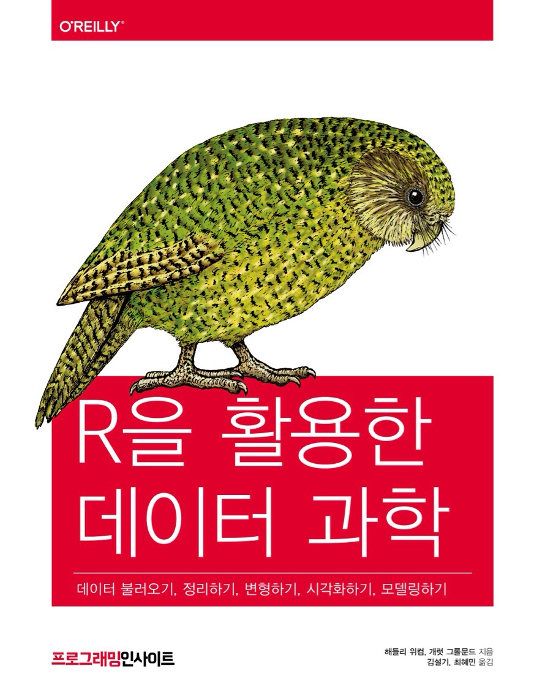

---
knit: "bookdown::render_book"
title: "R 을 활용한 데이터과학"
author: ["개럿 그롤문드", "해들리 위컴"]
description: "This book will teach you how to do data science with R: You'll learn how to get your data into R, get it into the most useful structure, transform it, visualise it and model it. In this book, you will find a practicum of skills for data science. Just as a chemist learns how to clean test tubes and stock a lab, you'll learn how to clean data and draw plots---and many other things besides. These are the skills that allow data science to happen, and here you will find the best practices for doing each of these things with R. You'll learn how to use the grammar of graphics, literate programming, and reproducible research to save time. You'll also learn how to manage cognitive resources to facilitate discoveries when wrangling, visualising, and exploring data."
url: 'https\://sulgik.github.io/r4ds/'
github-repo: sulgik/r4ds
twitter-handle: sulgik
cover-image: cover.png
site: bookdown::bookdown_site
documentclass: book
---

# 환영합니다 {-} 

 이 곳은 해들리 위컴과 개럿 그롤문드의 책 [**"R for Data Science"**](http://amzn.to/2aHLAQ1) 의 번역본인 **"R 을 활용한 데이터과학 (인사이트)"** 의 웹북입니다. 책의 5 개 부 중 "2 부 데이터 길들이기" 에 속한 7 장 ~ 13 장을 담고 있습니다. R 을 활용하여 데이터과학 업무를 시작할 때 도움이 되리라 생각합니다. 

책은 [알라딘](http://aladin.kr/p/K2RFR), [yes24](http://www.yes24.com/24/Goods/67856488?Acode=101) 에서 구입할 수 있습니다.

본 웹북은 [RMarkdown](https://rmarkdown.rstudio.com) 과 [bookdown](https://bookdown.org) 으로 작성되었습니다. 영문 웹북은 <https://r4ds.had.co.nz> 입니다.
