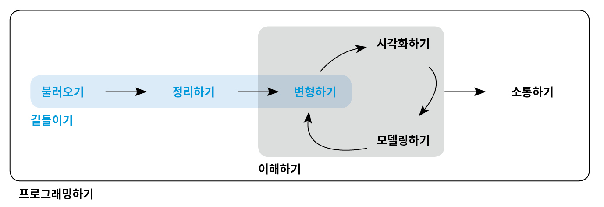

# (PART) 데이터 길들이기 {-}

# 소개 {#wrangle-intro}

여기에서는 시각화 및 모델링하기 편한 형태로 데이터를 R로 가져오는 기술인 데이터 길들이기(wrangling)에 대해 배운다. 이 단계 없이는 데이터 작업을 할 수 없기 때문에 매우 중요한 부분이다. 그림과 같이 ‘데이터 길들이기’에는 세 가지 주요 파트가 있다.

```{r echo = FALSE, out.width = "75%"}

```

다음과 같이 진행된다. 
 
* [티블](#tibble) 에서는 이 책에서 사용하는 데이터프레임의 변형인 **티블(tibble)** 에 대해 학습한다. 일반 데이터프레임과 어떻게 다른지를 배우고 ‘직접’ 생성하는 법을 배울 것이다.

* [데이터 불러오기](#data-import) 에서는 디스크에서 데이터를 R로 가져오는 법을 배운다. 일반 직사각형 텍스트 형식에 초점을 맞추겠지만, 다른 유형의 데이터를 지원하는 패키지도 알아본다.

* [타이디 데이터](#tidy-data) 에서는 타이디(tidy) 데이터에 대해 배운다. 일관성 있는 데이터 저장방법인 이것을 사용하면 변환, 시각화 및 모델링을 쉽게 할 수 있다. 기본 원칙을 배우고, 데이터를 타이디 형식으로 가져오는 방법을 배우게 된다. 
 
데이터 길들이기에는 우리가 이미 조금 알고 있는 데이터 변환도 포함된다. 실무에서 자주 접하게 될 세 가지 유형의 데이터에 대한 새로운 기술에 중점을 둘 것이다. 

* [관계형 데이터](#relational-data) 에서는 여러 개의 상호 연관된 데이터셋으로 작업하기 위한 도구를 배운다. 

* [문자열](#strings) 에서는 문자열 조작을 위한 강력한 도구인 정규표현식을 알아본다. 

* [팩터형](#factors) 에서는 어떻게 R 이 범주형 자료를 저장하는지를 배운다. 이 방법은 변수가 가질 수 있는 값이 고정된 집합일 때, 또는 문자열에 대해 알파벳순이 아닌 순서를 사용하려는 경우에 사용할 수 있다.

* [날짜와 시간](#dates-and-times) 에서는 데이트형과 데이트-타임형을 다루는 핵심 도구를 배울 것이다. 
